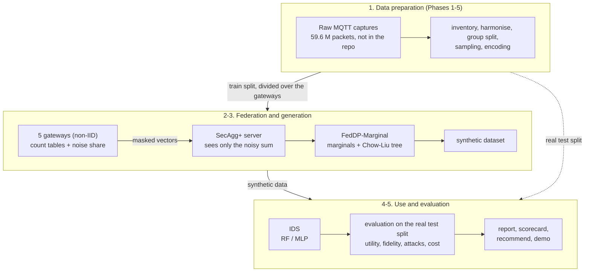

# PP-FedData

**English** | [Tiếng Việt](README.vi.md)

Privacy-preserving synthetic data for federated learning (FL): IoT / MQTT gateways that cannot share their raw traffic build a synthetic dataset together, under differential privacy (DP) and secure aggregation, to train an intrusion-detection system (IDS) for MQTT DoS / DDoS attacks.

## At a glance

| | |
|---|---|
| **Problem** | An IDS needs labelled attack traffic from many gateways, but the raw packets are private and each gateway sees only some of the attack classes (non-IID data). |
| **Approach** | **FedDP-Marginal**: every gateway (FL client) counts its own packets into per-class tables and adds its share of DP noise; the tables are summed by secure aggregation (Flower SecAgg+), so the server sees only a noisy total. A synthetic dataset is sampled from it and trains the IDS (Random Forest, MLP). |
| **Baseline** | The design the spec started from: a label-conditional CVAE trained by FL with DP-SGD and/or SecAgg+ (M1, M2, M3). |
| **Main result** | An IDS trained on the synthetic data only reaches test macro-F1 0.39 / 0.41 / 0.43 at ε 1 / 5 / 10, against 0.23-0.29 for the CVAE with DP and 0.42 for the CVAE without DP, in 3 rounds and under 1 MB of traffic (report section 9.9b). |
| **Threat model** | Honest-but-curious aggregation server. ε protects one packet by default; options make it cover a whole TCP stream, or hold with a minimum number t of honest gateways (section 9.11). |
| **What you get** | The framework and its CLI, a full evaluation (utility, fidelity, membership attacks, cost), a configuration guide per deployment requirement (`recommend`), a generated report and a Streamlit demo. |
| **Novelty** | Marginal-based DP synthesis is not new (MST, AIM, FLAIM). This work adds exact distributed DP through a real secure-aggregation implementation, a comparison with a CVAE under the same FL / DP / SecAgg for MQTT intrusion detection, and the requirement-driven guide. |

## How it works



1. **Data preparation (Phases 1-5).** The raw packet exports are inventoried, harmonised, split into train / validation / test by capture group (test groups are never seen in training), sampled to class quotas and encoded. Six classes: NORMAL, BCF, DELAYED, SYN, INVALID, WILL; one row is one packet.
2. **Federation.** The train split is divided over 5 clients with a per-class Dirichlet (α = 0.5), so most clients miss some attack classes.
3. **Generation.** FedDP-Marginal runs three releases through Flower SecAgg+: per-class 1-way tables, all attribute pairs (from which the server builds a Chow-Liu tree), then the tree's tables. Each client adds a share of Skellam noise; the privacy budget is accounted exactly. The server samples a synthetic dataset from the noisy tables.
4. **Evaluation.** An IDS trained on the synthetic data (TSTR) or on real + synthetic data (TAug) is tested on the real test split; fidelity, membership attacks and cost are measured; every choice is made on validation with 3 seeds.
5. **Analysis.** A run ledger feeds the report, the scorecard of all configurations and the per-requirement guide; the numbers in this README are generated from it.

The CVAE routes (B2, B3, M1-M3) go through the same steps 1, 2, 4 and 5. Diagrams of one run, the data flow and the code map: [docs/ARCHITECTURE.md](docs/ARCHITECTURE.md).

## Glossary

| Name | Meaning |
|---|---|
| **B0, B1a, B1b** | references trained on real data: real only, with class weights, with SMOTE |
| **B2, B3** | CVAE trained centrally (B2) or by FedAvg over the non-IID clients (B3); no DP, no SecAgg |
| **M1, M2, M3** | B3 + DP-SGD at each client (M1), + SecAgg+ (M2), + both (M3). M1o / M3o: re-tuned at full scale; M3f: DP-FedSGD |
| **FedDP-Marginal (MG)** | the framework's generator. MGs: Skellam noise split over the clients, summed by Flower SecAgg+. MGr: MGs + post-processing. MGd: Gaussian noise split (simulated). MGl: local DP, every client adds the full noise. MGb: Bayesian-network option |
| **MG-eps1 / 5 / 10** | the framework's main configurations: MGr-eps1, MGs-eps5, MGs-eps10 |
| <code>-&#8288;eps&lt;e&gt;</code>, **ε, δ** | DP budget per record, ε ∈ {1, 5, 10}, δ = 1e-5 |
| <code>-&#8288;strm&lt;m&gt;</code><br><code>-&#8288;cap&lt;m&gt;</code><br><code>-&#8288;t&lt;t&gt;</code> | ε covers a whole TCP stream / capture (at most m rows per unit); noise calibrated for t honest clients |
| **TRTR, TSTR, TAug, TAugR** | train real; train synthetic; train real + synthetic; real + synthetic for the rare classes only. Always tested on the **real** test split |
| **macro-F1, binary F1, rare recall** | mean F1 over the 6 classes (main metric); attack vs normal; mean recall of DELAYED, SYN, INVALID, WILL |
| **MIA, C2ST** | membership-inference attack AUC (0.5 = the attacker learns nothing); classifier test real vs synthetic (0.5 = indistinguishable) |
| **SecAgg+** | Flower's secure aggregation: the server obtains only the sum of the clients' vectors |
| **K, α, h, t** | number of clients (5); Dirichlet non-IID parameter (0.5); number of honest clients; number of honest clients the noise is calibrated for |
| **Phases 0-13, O0-O5, P1-P2, G1-G4** | stages of the spec, the optimisation round, the follow-up round, the user's approval gates |

## Where to read what

| To... | Read |
|---|---|
| understand the design and the code | [docs/ARCHITECTURE.md](docs/ARCHITECTURE.md), then the README of each folder ([src/ppfeddata](src/ppfeddata/README.md), [configs](configs/README.md), [results](results/README.md), [tests](tests/README.md), [demo](demo/README.md)) |
| see every result and its interpretation | [results/reports/final_report.md](results/reports/final_report.md): 9.0 summary, 9.9b why FedDP-Marginal, 9.10b per requirement, 9.11 follow-up round |
| choose a configuration for a deployment | [results/reports/recommend.md](results/reports/recommend.md), the interactive page `results/reports/recommend.html` (download and open it), demo page 3 |
| know the rules the work follows | [docs/PP-FedData_Implementation_Spec.md](docs/PP-FedData_Implementation_Spec.md) |
| know why something differs from the spec, with the evidence | [docs/SPEC_DEVIATIONS.md](docs/SPEC_DEVIATIONS.md) (in Vietnamese) |
| re-run everything | Installation, Data, Running each phase, Reproducing the results (below) |

## Results and how to read them

The block below is **generated** from `results/interpretation.json` each time `python -m ppfeddata.cli aggregate` runs; do not edit it by hand. It is an excerpt of the final report
([`results/reports/final_report.md`](results/reports/final_report.md), section 9). **Read the "Why FedDP-Marginal and not the CVAE?" and "Why a CVAE at all?" paragraphs before using the recommended configuration:** the recommendation (R6)
ranks the protected generators against each other; it does not say that synthetic data beat real data when the real data can be pooled. Which configuration to use for which deployment requirement
is in sections 9.10 and 9.10b of the report, in `results/reports/recommend.md` and on page 3 of the demo; the privacy unit, the honest-client threshold, the IDS-side options and local augmentation are in section 9.11.

<!-- BEGIN GENERATED: results -->
*Generated by `ppfeddata aggregate` from `results/interpretation.json` (219 runs, seeds [0, 1, 2], 30,000 real test rows from 11 capture groups; macro-F1 on the real test split). The text is the one of section 9.0 of `results/reports/final_report.md`, which has the intervals, the red flags and the method (section 9.9 explains why the study uses a CVAE).*

- **R1 - Does synthetic data improve the IDS?** Short answer: RF: 1 of 13 generators pass, the best by +0.002 (SMOTE +0.057); MLP: 10 of 13 generators pass, the best by +0.030 (SMOTE +0.140). Test macro-F1, real + synthetic minus real only: RF: 1 of 13 generators better, 11 no effect, 1 worse (delta -0.0021 to +0.0020); MLP: 10 of 13 generators better, 3 no effect, 0 worse (delta +0.0068 to +0.0300). Recall of the rare classes (DELAYED/SYN/INVALID/WILL, RF) moves by at most 0.012 for any generator, against +0.063 to +0.102 (mean of the four) for the SMOTE / class-weight references. Reference macro-F1 deltas: B1a +0.045 (RF), B1b +0.057 (RF), B1b +0.140 (MLP).
- **R2 - Is the CVAE better than the simple methods?** No. TAug with the CVAE (B2, B3) against class weights (B1a, RF) and SMOTE (B1b): 6 of 6 comparisons worse, 0 no effect, 0 better (macro-F1 delta -0.1239 to -0.0438; rare-class recall delta -0.175 to -0.062).
- **R3 - What does non-IID FL cost?** B2 minus B3 in test macro-F1: TSTR-RF +0.0172, TSTR-MLP +0.0119, TAug-RF +0.0006, TAug-MLP -0.0088. Relative loss in TSTR-RF: 4.2 %. Reported only; the spec sets no pass / fail threshold.
- **R4 - What does DP cost, and what does it bring?** Cost, plain decoder against the epsilon = infinity point: TSTR macro-F1 delta -0.1834 to +0.0275 (8 of 12 comparisons worse), TAug delta -0.0075 to +0.0009 (12 of 12 no effect). Over epsilon = 1, 5, 10 the TSTR-RF curve is monotone within noise and not flat (range 0.161 against seed std up to 0.029). Benefit: no empirical benefit is measurable. MIA AUC is 0.488-0.498 at every epsilon including infinity (spread 0.010), it does not approach 0.5 as epsilon shrinks, and the attack did not detect an over-fitted CVAE (AUC 0.519), so the positive control of the spec is not met for the CVAE. What DP brings is the formal guarantee (record level, see 9.8). A second attack, with access to the released model (record fit under the model, calibrated by a reference model), passes its positive control (AUC 0.664 on the over-fitted CVAE against 0.519 for the attack on the synthetic data); against the federated models it gives B3 0.500, M1-eps10 0.496, M1-eps5 0.496, M1-eps1 0.497; it detects nothing (AUC < 0.55) in any of them.
- **R5 - What does SecAgg cost?** Utility (M2 - B3 and M3 - M1-eps5, 8 comparisons): 8 no effect, 0 better, 0 worse (largest |delta| 0.0113); the differences are inside the seed noise. Overhead: M2 / B3: 1.12x time per round, 1.52x bytes per parameter per round; M3-eps5 / M1-eps5: 1.02x time per round, 1.55x bytes per parameter per round.
- **R6 - Recommended configuration.** Rule: MIA AUC <= 0.55, epsilon <= 5 when DP is used, time per round <= 3x plain FL (B3), then the highest TAug macro-F1 (RF). Eligible: B3, M2, MG-eps1, MG-eps5, MGl-eps1, MGl-eps5. The literal rule picks MG-eps5; tied within noise: B3, M2, MG-eps5, MGl-eps5; **MG-eps5**. DP configurations fail the overhead filter (M1-eps1 4.37x, M1-eps5 4.27x, M1-eps10 4.53x, M3-eps5 4.35x), not utility or MIA: every candidate's TAug-RF macro-F1 lies in 0.4451-0.4492. If a formal DP guarantee is required, the DP option the rule would pick without the overhead filter is M1-eps1 (tied: M1-eps1, M3-eps5, MG-eps5, MGl-eps5).
- **Which of M1, M2, M3 for which requirement?** Utility does not decide it (the TAug-RF macro-F1 of every candidate lies in 0.4451-0.4492); what each one protects and what it costs does (9.10). **M2** if only the aggregation server must not see the updates (1.12x time per round, 1.52x bytes per parameter, utility: 4 of 4 comparisons with B3 show no effect; no epsilon); **M1-eps1** if a formal guarantee on the released model or synthetic data is required (TSTR macro-F1 -47 to 7 % against epsilon = infinity, recall of the rare classes 0.09-0.32 against 0.31, 4.3-4.5x time per round); **M3-eps5** if both are needed (on top of M1-eps5: 1.02x time, 1.55x bytes per parameter, 4 of 4 utility comparisons show no effect). These are costs and guarantees, not a measured privacy benefit: the empirical attack is at chance for every configuration (R4). If the goal is only a detector, training it directly by FL is the alternative to all three (9.9).
- **Do the answers depend on the test groups or the sampling?** Extensions A4-s1, A4-s2, A5-cap20 re-ran the study from Phase 3 with one setting changed: 5 of 6 comparisons (R1, synthetic-only against real data, DP cost) keep their verdict in every world; those that change: real + synthetic (B3) minus real only (RF): R1 (main none, A4-s1 better, A4-s2 better, A5-cap20 none). Section 8c has the numbers; the choice of other datasets, quotas and client counts is not covered.
- **Why a CVAE at all?** R1 and R2 support the CVAE only in part as a way to improve the IDS (worse than class weights and SMOTE in 6 of 6 comparisons; generators better than real data only: RF 1 of 13, at most +0.002 against +0.057 for SMOTE, MLP 10 of 13, at most +0.030 against +0.140 for SMOTE). The CVAE is the premise of the spec (a federated, label-conditional generator whose data balance the classes of the IDS), not the outcome of a comparison between generators, and this study is its test. What is left of the case is the setting where raw data cannot be pooled, which TAug, B0 and B1 all need: there the synthetic data alone give RF 0.396 (B3), 0.398 (M2) against 0.447 for real data only, without pooling the raw data. Tested after the main study: training the MLP itself by FedAvg on the same clients (no generator) reaches macro-F1 0.429 with class weights (the clients then share their class counts) and 0.319 without, against 0.420 for the CVAE route (synthetic data only, TSTR-MLP): the class-weighted federated MLP is not different from (inside the noise) it (delta +0.009), the plain one below it (delta -0.101). Given the same protections (SecAgg numerics, DP at epsilon 1, 5, 10, both) and a little tuning on validation, the direct classifier is above the CVAE route with the same protection in 2 of 6 cases, not different in 4 and below in 0. Not tested, so the CVAE is not shown to be the best option even there: federated SMOTE, other generators. See 9.9.
- **Why FedDP-Marginal and not the CVAE?** Under DP the CVAE route stays far from its non-DP version even after re-tuning per epsilon at full scale (O1), while the federated DP marginal generator does not (TSTR macro-F1, test, mean over seeds: ε 1: MGr-eps1 0.389 against the best CVAE route M1-eps1 0.227; ε 5: MGs-eps5 0.408 against the best CVAE route M1o-eps5 (plain) 0.287; ε 10: MGs-eps10 0.429 against the best CVAE route M1o-eps10 0.289; B3, the CVAE without DP: 0.420). It also sends three small rounds instead of tens of model rounds, and its noise can be split over the clients through secure aggregation with exact accounting. The framework therefore uses FedDP-Marginal; the CVAE stays as the baseline. Not an algorithmic novelty (FLAIM, MST, AIM); see 9.9b.
- **Follow-up round (9.11).** On this data, epsilon for a whole TCP stream costs FedDP-Marginal 0.02-0.04 TSTR macro-F1, for a whole capture it falls to 0.15-0.20; calibrating the noise for 3 honest clients of 5 changes it by -0.001 to +0.003; class-probability weights chosen on validation raise the TSTR of the IDS (MG-eps5 RF 0.414 → 0.432, MG-eps5 MLP 0.404 → 0.444); a client that adds FedDP-Marginal rows for the classes it lacks gains +0.036 macro-F1 on average (0.387 → 0.422, 15 of 15 client models better).
- **Red flags** (spec Phase 12): F1 (macro-F1 near 1.00, B0 included): not triggered; F2 (TSTR above TRTR): TRIGGERED, investigated: not above the class-balanced real reference; F3 (model copies training data): not triggered; F4 (large spread between seeds): TRIGGERED (only in rows outside the spec matrix) - more seeds or a stability check; F5 (reported epsilon far from an independent recomputation): not triggered. Details in 9.7.

Candidate configurations of the recommendation rule (R6); macro-F1 of the RF classifier, mean over seeds:

| configuration | TAug macro-F1 | TSTR macro-F1 | MIA AUC | epsilon (max) | time per round vs B3 | eligible |
|---|---|---|---|---|---|---|
| B2 | 0.4483 | 0.4133 | 0.495 | - | - | no |
| B3 | 0.4478 | 0.3961 | 0.491 | - | 1.00 | yes |
| M1-eps1 | 0.4477 | 0.2270 | 0.492 | 0.997 | 4.37 | no |
| M1-eps5 | 0.4467 | 0.2451 | 0.488 | 4.999 | 4.27 | no |
| M1-eps10 | 0.4471 | 0.2293 | 0.488 | 9.999 | 4.53 | no |
| M2 | 0.4478 | 0.3979 | 0.492 | - | 1.12 | yes |
| M3-eps5 | 0.4476 | 0.2565 | 0.489 | 4.999 | 4.35 | no |
| MG-eps1 | 0.4451 | 0.3894 | 0.496 | 1.000 | - | yes |
| MG-eps5 | 0.4482 | 0.4084 | 0.490 | 5.000 | - | yes |
| MG-eps10 | 0.4492 | 0.4133 | 0.495 | 10.000 | - | no |
| MGl-eps1 | 0.4463 | 0.2526 | 0.498 | 1.000 | - | yes |
| MGl-eps5 | 0.4470 | 0.3740 | 0.493 | 5.000 | - | yes |
| MGl-eps10 | 0.4483 | 0.4134 | 0.495 | 10.000 | - | no |

For reference (trained and tested on real data): B0 real data only: RF 0.447, MLP 0.328; B1a class weights: RF 0.492; B1b SMOTE: RF 0.504, MLP 0.469.
<!-- END GENERATED: results -->

## Demo

```bash
python -m ppfeddata.cli demo
```

Opens a Streamlit app with five pages (the interface is in Vietnamese): (1) data overview and class distribution, (2) tables and figures of the results, (3) utility - privacy - overhead trade-off, the recommendation and
which configuration for which requirement, (4) sample generation (choose a configuration, a class and a number of rows; download CSV), (5) threat model and limitations. The demo only reads the `results/` and `artifacts/`
that the experiments produced, and samples from the trained generators (FedDP-Marginal or a CVAE) through the same code path as the evaluation. DP configurations of the CVAE are sampled with the plain decoder only (the
per-class residual noise is estimated on the whole train split, so it lies outside epsilon). No telemetry is sent (`.streamlit/config.toml`). Pages and their inputs: [demo/README.md](demo/README.md).

## Installation

Python ≥ 3.10 is required (the experiments ran on Python 3.13, Windows 11, CPU).

```bash
python -m venv .venv
# Windows: .venv\Scripts\activate     Linux/macOS: source .venv/bin/activate
python -m pip install -r requirements.txt
python -m pip install -e .
python -m ppfeddata.cli --help
python -m pytest -q
```

To get exactly the versions the results were produced with: `python -m pip install -r requirements-lock.txt` (a `pip freeze`; a copy is in `results/repro/pip_freeze.txt`).

Flower simulates FL with **Ray** (`ray` is in `requirements.txt`; the `flwr[simulation]` extra does not install Ray on Windows with Python 3.13). On Windows, Ray is experimental with Flower: it works here, but an actor died
twice mid-run (SPEC_DEVIATIONS 8.1, 9.8), so a round that lacks a client's reply stops at once and `run_fl` restarts from the checkpoint at most twice. For PyTorch, if you need the CPU build:
`python -m pip install torch --index-url https://download.pytorch.org/whl/cpu`.

### Library versions

<!-- BEGIN GENERATED: libraries -->
Python 3.13.5 on Windows 11. Versions installed when `ppfeddata aggregate` last wrote this block; the exact lock is `requirements-lock.txt` (a copy is in `results/repro/pip_freeze.txt`).

| library | version |
|---|---|
| numpy | 2.3.2 |
| pandas | 2.3.1 |
| pyarrow | 25.0.1 |
| scikit-learn | 1.9.1 |
| scipy | 1.18.1 |
| imbalanced-learn | 0.14.2 |
| torch | 2.14.1 |
| flwr | 1.39.0 |
| opacus | 1.6.0 |
| ray | 2.59.0 |
| optuna | 5.0.0 |
| joblib | 1.6.0 |
| matplotlib | 3.10.5 |
| pyyaml | 6.0.3 |
| streamlit | 1.65.0 |
| pytest | 9.1.1 |
| psutil | 7.2.2 |
<!-- END GENERATED: libraries -->

## Data

The raw data (the DoS-DDoS-MQTT-IoT dataset, 59.6 million rows, about 13 GB of CSV) are **not in the repository**; the repository contains no data row at all (the processed data included). Put the path on your machine in `configs/local.yaml`
(not committed) or in the environment variable `PPFEDDATA_RAW_ROOT`:

```yaml
# configs/local.yaml
paths:
  raw_root: "D:/path/to/DoS-DDoS-MQTT-IoT_Dataset"
```

Committed: `results/manifests/split_manifest_<mode>.json` (group ids, counts, hashes, library versions; no data row) and `results/manifests/feature_schema_<mode>.json` (encoding parameters, counts).
Not committed: `data/`, `artifacts/`, `results/*.csv`, `configs/local.yaml`.

## Running each phase

Every command runs from the root of the repository. Every long process writes checkpoints and can be resumed (a finished run is skipped); `--no-resume` forces a re-run. There are two label modes: `6class`
(the default, used by every experiment) and `11class` (`--label-mode 11class`: data preparation only, no run of the matrix uses it).

| Phase | Job | Command | Main output |
|---|---|---|---|
| 0 | check the environment | `python -m pytest -q` |  |
| 1 | inventory of the raw data | `python -m ppfeddata.cli inventory` | `data/inventory/*.csv` |
| 2 | harmonise the schema, audit the formats (Gate G1) | `python -m ppfeddata.cli harmonize` | `configs/feature_decisions.yaml`, `results/reports/g1_feature_review.md` |
| 3 | split by group, streaming sampling | `python -m ppfeddata.cli sample` | `data/interim/<mode>/`, `results/manifests/split_manifest_<mode>.json` |
| 4 | preprocessing | `python -m ppfeddata.cli preprocess` | `data/processed/<mode>/` (`train/val/test.npz`, `feature_schema.json`, `preprocessor.joblib`) |
| 5 | leakage checks (Gate G2) | `python -m ppfeddata.cli check` | `results/reports/leakage_report.md` |
| 6 | baselines B0, B1a, B1b (Gate G3) | `python -m ppfeddata.cli baseline` | `results/runs.csv`, `results/reports/g3_baseline.md` |
| 7 | tune the CVAE hyper-parameters (Optuna, resumable) | `python -m ppfeddata.cli tune` | `configs/best_cvae.yaml` |
| 7 | B2: centralised CVAE | `python -m ppfeddata.cli b2` | `results/reports/b2_cvae.md` |
| 7 | resource benchmark | `python -m ppfeddata.cli benchmark` | `results/reports/compute_budget.md` |
| 8 | B3: CVAE + non-IID FedAvg | `python -m ppfeddata.cli b3` | `results/reports/b3_fl.md` |
| 9 | M1: + DP-SGD at the client | `python -m ppfeddata.cli m1` | `results/reports/m1_dp.md` |
| 9 | hyper-parameter search specific to DP | `python -m ppfeddata.cli tune-dp` | `artifacts/optuna_dp_eps5_<mode>.db` |
| 9 | run real FL for the best trials and pick the winner on validation | `python -m ppfeddata.cli verify-dp --trials <number of trials of tune-dp>` | `configs/best_cvae_dp.yaml` |
| 9 | M1 with the DP-specific hyper-parameters | `python -m ppfeddata.cli m1 --tuned` | `results/reports/m1_dp_tuned.md` |
| 10 | M2: + SecAgg+ | `python -m ppfeddata.cli m2` | `results/runs.csv` |
| 10 | M3: DP + SecAgg+ | `python -m ppfeddata.cli m3` | `results/runs.csv` |
| 10 | SecAgg checks on real data (T-SA1, T-SA2, T-SA3) | `python -m ppfeddata.cli secagg-check` | `artifacts/secagg_checks_<mode>.json` |
| 10 | SecAgg report | `python -m ppfeddata.cli secagg-report` | `results/reports/m2_m3_secagg.md` |
| 11 | one-seed trial of the whole matrix (Gate G4) | `python -m ppfeddata.cli run --stage trial` | `results/reports/g4_trial.md` |
| 11 | the full three seeds, only after reading `g4_trial.md` | `python -m ppfeddata.cli run --stage full --approve-g4` | `results/runs.csv` |
| 11-12 | aggregate and interpret | `python -m ppfeddata.cli aggregate` | `results/summary.csv`, `results/figures/*.png`, `results/reports/final_report.md`, `results/interpretation.json`, the generated blocks of the READMEs |
| 13 | demo | `python -m ppfeddata.cli demo` |  |
| 13 | reproducibility bundle | `python -m ppfeddata.cli package` | `results/repro/`, `results/manifests/feature_schema_<mode>.json`, `requirements-lock.txt` |
| 13 | acceptance: check every item of the Definition of Done against the files | `python -m ppfeddata.cli accept` | `results/reports/dod_checklist.md` |
| 13+ | the IDS classifier itself trained by FedAvg on the same clients (the alternative to the CVAE route); run `aggregate` after it (with `--protected`: tune it and add SecAgg numerics and DP) | `python -m ppfeddata.cli fed-baseline` (then `python -m ppfeddata.cli fed-baseline --protected`) | `results/fed_classifier.json` |
| 13+ | extensions A4 (other test groups) and A5 (cap on packets per stream): re-run Phase 3-4, B0, B3 (and M1-eps5) in separate worlds | `python -m ppfeddata.cli sensitivity` | `results/sensitivity.json`, `results/reports/sensitivity.md` |
| 13+ | membership inference with access to the released model, with positive controls (B3 and M1 on random halves of the train pool; hours of CPU) | `python -m ppfeddata.cli mia` | `results/mia_model.json` |
| O0 | optimisation round: scorecard of B3, M1, M2, M3 on every metric (macro-F1, binary F1, rare-class recall, TAug gain, epsilon, SecAgg, MIA, cost) and their Pareto front; `--freeze-baseline` once, as the reference of the later stages | `python -m ppfeddata.cli scorecard` | `results/scorecard.json`, `results/reports/scorecard.md` |
| O1 | optimisation round: DP search at full scale (real FL runs, seed 0), one study per epsilon, also over rounds, local epochs, class weights and the DP residual statistics; validation only. With `--final`: the best trial of each epsilon with every seed as `M1o-...` and `M3o-...` | `python -m ppfeddata.cli tune-dp-full` (then `python -m ppfeddata.cli tune-dp-full --final`) | `configs/best_cvae_dp_full.yaml`, `results/runs.csv` |
| O1 | optimisation round: TAugR = all real rows + synthetic rows for the rare classes only (ratio × their real count, chosen on validation with seed 0), from the saved synthetic sets of the scorecard generators; no generator is trained again | `python -m ppfeddata.cli taug-rare` | `results/runs.csv` (`<prefix>-TAugR-<clf>`), column "TAugR gain" of the scorecard |
| O2 | optimisation round: M3-distributed = DP-FedSGD (one gradient step per round, each client adds 1/K of the Gaussian noise, the sum comes from secure aggregation; in-process simulation with the SecAgg+ quantisation), search per epsilon on validation; with `--final`: the best trial of each epsilon with every seed as `M3f-...`; epsilon also reported for a single honest client | `python -m ppfeddata.cli tune-fedsgd` (then `python -m ppfeddata.cli tune-fedsgd --final`) | `configs/best_cvae_fedsgd.yaml`, `results/runs.csv` |
| O2 | optimisation round (bandwidth): M2 with the SecAgg+ masked vectors sent as uint32 (`c32`, modulus 2^32, same aggregate as M2) or uint16 (`c16`, modulus 2^16, 2^13 quantisation levels) instead of Flower's int64; `--m3-eps 5` also runs the O1 winner with SecAgg+ at that level | `python -m ppfeddata.cli secagg-bits` | `results/runs.csv` (`M2-c32`, `M2-c16`, `M3o-...-c16`) |
| O3 | optimisation round: second generator = federated DP marginals with a Chow-Liu tree (three releases of count tables summed by secure aggregation, Gaussian noise split over the clients or local); grid of coarse bins x budget split per epsilon on validation, then every seed as `MGd-eps<e>` (distributed) and `MGl-eps<e>` (local) | `python -m ppfeddata.cli tune-marginal` (then `python -m ppfeddata.cli tune-marginal --final`) | `configs/best_marginal.yaml`, `results/runs.csv` |
| O3 | optimisation round: FedDP-Marginal options (per-class Bayesian network: degree 2, structure per class, bins per class, fine bins, budget split), each alone and the winning combinations, scored by the mean of 3 seeds on validation; kept only when they beat the tree by more than the seed std | `python -m ppfeddata.cli tune-marginal --bn` | `configs/best_marginal_bn.yaml` |
| O3 | optimisation round: membership inference with access to the released FedDP-Marginal tables (log-likelihood, calibrated by a reference model fitted on disjoint rows), with positive controls without noise | `python -m ppfeddata.cli mia-marginal` | `results/mia_marginal.json` (MIA column of the scorecard) |
| O4 | optimisation round: FedDP-Marginal under other federations (Dirichlet α 0.1 / 10 and 10 / 20 clients, ε 5; distributed variant one seed since the released sums do not depend on the partition, local variant 3 seeds) and with 11 classes (B0, MGs, MGr, 3 seeds) | `python -m ppfeddata.cli robustness` | `results/robustness.json`, `results/reports/robustness.md` |
| P1 | follow-up round: group-level DP of FedDP-Marginal (a TCP stream or a capture is the protected unit: whole units per client, capped at m records, m chosen on validation with 3 seeds) and the honest-client threshold t (each client adds 1/t of the noise); 3 seeds through Flower SecAgg+ | `python -m ppfeddata.cli privacy-units` | `configs/best_group_dp.yaml`, `results/reports/privacy_units.md` |
| P2 | follow-up round: IDS-side options on the synthetic data (all 20,000 rows per class, class-probability weights chosen on validation; every generator) and local augmentation at each client (own real rows + synthetic rows of the federation for the classes it lacks) | `python -m ppfeddata.cli ids-followup` | `results/ids_followup.json`, `results/reports/ids_followup.md` |
| O4 | optimisation round: which configuration for which deployment requirement (server / clients trusted, epsilon budget, MB per round, MB in total, rounds, priority macro / binary / rare, minimum rare recall); without options the example IoT scenarios; a static page with the same filters | `python -m ppfeddata.cli recommend` | `results/recommend.json`, `results/reports/recommend.md`, `results/reports/recommend.html` |

`configs/best_cvae.yaml` and `configs/best_cvae_dp.yaml` are committed: you can skip `tune`, `tune-dp` and `verify-dp` and use the selected hyper-parameters directly. The configurations of the matrix are in
`configs/exp/*.yaml` (`python -m ppfeddata.cli run --stage trial --dry-run` prints the plan without running anything).

## Reproducing the results

1. Install the exact versions: `python -m pip install -r requirements-lock.txt`, then `python -m pip install -e .`.
2. Prepare the data (Phases 1-5). The seed of the group split and of the sampling is `split.split_seed` (default 0); compare `results/manifests/split_manifest_<mode>.json` (parquet hashes) with yours.
3. Run the matrix: `python -m ppfeddata.cli run --stage trial` re-runs **the whole matrix for one seed in a workspace of its own** (`artifacts/_trial`) and compares it with the results already there; the report is `results/reports/g4_trial.md`.
   After reading it, `run --stage full --approve-g4` runs all three seeds.
4. `python -m ppfeddata.cli aggregate` regenerates the tables, the figures, the report and the generated blocks of the READMEs.
5. `python -m ppfeddata.cli package` writes `results/repro/`: `pip_freeze.txt`, a copy of `configs/`, `environment.json` (Python, platform, library versions, git commit, whether the tree was clean) and `MANIFEST.json`
   (SHA-256 of the run ledger, the summary, the report, the manifests, the schema, the configs). The seeds of every run are `{0, 1, 2}`; each row of `results/runs.csv` records the seed, the `config_hash` and the `git_commit`.

## Repository layout

```
PP-FedData/
├── src/ppfeddata/        the package; one CLI sub-command per stage (cli.py)
│   ├── data/             Phases 1-4: inventory, harmonise, group split + sampling, preprocessing
│   ├── checks/           Phase 5: leakage checks
│   ├── eval/             Phase 6: classifiers, protocols, metrics, fidelity, privacy, bootstrap, run ledger
│   ├── models/           generators: CVAE (cvae, train, generate) and FedDP-Marginal (marginal, marginal_bn)
│   ├── fl/               Flower: FedAvg (B3), DP-SGD (M1), SecAgg+ (M2, M3), FedDP-Marginal over SecAgg+ (mg_app)
│   └── *.py              partition, experiment control and tuning, analysis (aggregate, interpret, scorecard,
│                         recommend), reporting (interpret_report, limitations, readme_gen), demo logic, acceptance, package
├── configs/              default.yaml (every parameter), best_*.yaml (settings chosen on validation), exp/ (experiment matrix),
│                         feature_decisions.yaml, label_map.yaml; local.yaml (machine paths, not committed)
├── results/              committed results: reports/, figures/, *.json, manifests/, repro/; runs.csv and summary.csv not committed
├── docs/
│   ├── ARCHITECTURE.md, ARCHITECTURE.vi.md   components, data flow, privacy mechanics, code map
│   ├── PP-FedData_Implementation_Spec.md     the rules (spec v1.5)
│   └── SPEC_DEVIATIONS.md                    every deviation from the spec, with evidence (Vietnamese)
├── tests/                pytest for every stage
├── demo/                 app.py (Streamlit)
├── notebooks/            empty; reserved for view-only notebooks (no logic)
├── data/, artifacts/     written by the runs: processed data, partitions, models, synthetic data, predictions (not committed)
└── README.md, README.vi.md, LICENSE, pyproject.toml, requirements.txt, requirements-lock.txt
```

Each folder with code, settings or results has a README that lists its files and how they are produced: [src/ppfeddata](src/ppfeddata/README.md),
[configs](configs/README.md), [results](results/README.md), [tests](tests/README.md), [demo](demo/README.md). How the pieces work together: [docs/ARCHITECTURE.md](docs/ARCHITECTURE.md).

## Reference run times

<!-- BEGIN GENERATED: times -->
Wall time of the whole matrix for **one seed**, run from scratch with one command (`python -m ppfeddata.cli run --stage trial`, seed [0]), on Python 3.13.5, torch 2.14.1+cpu, Opacus 1.6.0, CUDA available: False (all timings are CPU, 10 threads), Intel64 Family 6 Model 186 Stepping 2, GenuineIntel: **39.9 min**. The evaluation of every generator (fidelity, privacy, TSTR and TAug with RF and MLP) is included. Source: `results/reports/g4_trial.md`; a Colab CPU session will differ.

| configuration | status | minutes |
|---|---|---|
| B0 | done | 0.5 |
| B1a | done | 0.0 |
| B1b | done | 1.4 |
| B2 | done | 2.0 |
| B3 | done | 3.0 |
| M2 | done | 3.3 |
| M1-eps1 | done | 8.9 |
| M1-eps5 | done | 6.6 |
| M1-eps10 | done | 7.1 |
| M3 | done | 7.1 |
<!-- END GENERATED: times -->

The cost of one epoch (plain and DP-SGD) and the extrapolation: `results/reports/compute_budget.md`.

## Limitations

The full list, shared with the final report (section 10) and page 5 of the demo:

<!-- BEGIN GENERATED: limitations -->
<details><summary>26 limitations (the list of section 10 of the final report and of page 5 of the demo)</summary>

- **Packet-level data, record-level epsilon.** The data are packet-level and epsilon is per record (one packet). Packets of one TCP stream and of one capture are correlated, so what DP protects about a whole attack session or capture is much weaker than epsilon suggests (group privacy). In the train split a stream gives 1.0-1.2 rows on average, but one capture group gives up to 63-188 rows of a rare class, so the correlated unit of this data is the capture, not the stream (section 9.10). FedDP-Marginal now offers epsilon for a whole unit (follow-up round P1: each unit held by one client, at most m of its rows used): a TCP stream costs 0.02-0.04 TSTR macro-F1 (0.353 vs 0.389 at epsilon 1; 0.371 vs 0.408 at epsilon 5; 0.409 vs 0.429 at epsilon 10), a whole capture does not fit the data (TSTR macro-F1 0.15-0.20, 3,675 rows kept), so captures stay protected only through the group bound. *(spec Definition of Done; sections 9.8, 9.10; results/reports/privacy_units.md)*
- **Labels are not protected.** As in the spec, the claim of epsilon is scoped to the features of a record: the class label is treated as known side information. Epsilon is not claimed to hide labels, class counts or which classes a client holds. *(spec Definition of Done)*
- **Time features and independent packets.** The time features (gap to the previous frame, time since the first frame of the stream, round-trip time) depend on how the capture was exported, and the CVAE generates every packet independently: a generated packet has no stream context, so the temporal structure of a session is not reproduced. *(spec Definition of Done; leakage_report.md (ablation without the time columns))*
- **Non-private tuning.** The hyper-parameters of the CVAE (and of the DP variant) were tuned on real, non-private validation data; tuning is not covered by epsilon. *(SPEC_DEVIATIONS 7.3, 9.5, 9.14)*
- **Single-machine simulation.** Federated training is simulated on one machine (Flower simulation, the clients are Ray actors sharing the same CPU): no network latency is measured, so the times per round are compute time on this machine, neither the sum of the clients' times nor what a deployment would see. Ray on Windows was unstable (SPEC_DEVIATIONS 9.8). *(compute_budget.md; SPEC_DEVIATIONS 8.10, 9.8)*
- **Normalisation uses central statistics.** Standardisation, the log1p choices, the category lists and the mask of unused categories were computed centrally on the pooled train split (88,500 rows), as if every client had shared its data once. A real federation would have to compute them securely or fix them beforehand. They are not covered by epsilon, and neither are the per-class scales of the residual-noise variant (the rows without the `-plain` suffix). *(spec Definition of Done; SPEC_DEVIATIONS 7.1, 8.8)*
- **Test split from few capture groups.** The real test split comes from 11 capture groups and 20,343 TCP streams. Sensitivity A4 was run with 2 other choices of the validation and test groups (test groups shared with the main study: 1, 0): 5 of 6 comparisons keep the same verdict in every world (section 8c). The groups still come from few captures, and the sensitivity covers only these choices. *(leakage_report.md; SPEC_DEVIATIONS 3.3-3.5)*
- **Thresholds are heuristics.** The thresholds of the evaluation (`thresholds` in configs/default.yaml; mia_auc_max = 0.55, eps_max_recommend = 5, overhead_ratio_max = 3, seed_std_max = 0.02, seed_std_redflag = 0.05) are heuristics fixed by the user, not derived from data. Verdicts such as "eligible" in R6 and the red flags depend on them; four were added in Phase 12 (SPEC_DEVIATIONS 12.1). *(configs/default.yaml; SPEC_DEVIATIONS 12.1)*
- **One dataset.** All results come from one dataset (the MQTT-IoT-IDS DoS/DDoS capture); nothing here shows that they carry over to other traffic or other networks. *(spec Definition of Done)*
- **Attack classes are hard to tell apart packet by packet.** The real-data-only classifiers reach macro-F1 0.447 (RF) and 0.328 (MLP). A generator of independent packets cannot create separability that the features do not contain. *(g3_baseline.md; section 9.1)*
- **Block splits inside one capture.** 8 of the 11 sub-classes come from a single capture file, so their validation and test rows are consecutive blocks of the same capture, not other captures. Dropping the TCP streams that straddle two blocks removes 1.2 % to 9.9 % of the eligible rows of each such sub-class (a bias toward short connections). *(results/manifests/split_manifest_6class.json; SPEC_DEVIATIONS 3.3, 3.5)*
- **Protocol filter.** Only rows with protocol TCP or MQTT are kept. The filter removes about 0.5 % of the Normal rows and the 128 RIPv2 rows of the attack data. *(SPEC_DEVIATIONS 2.9, 3.5)*
- **Multi-valued cells.** Only the first element of a multi-valued cell is kept (policy `first_only`). The information of several MQTT messages in one packet is lost; part of it remains in `tcp_segment_len`. *(SPEC_DEVIATIONS 2.4, 4.3)*
- **Tail of the time-gap feature.** The tail of `time_delta_from_previous_displayed_frame` is still clipped at 5 sigma: 72 of 88,500 train rows (0.08 %) after the x1000 scaling; without the scaling it was 1.04 %. Extreme gaps are therefore merged in the features and in the generated rows. *(feature_schema.json audit; SPEC_DEVIATIONS 4.10)*
- **Very sparse columns.** Columns that are empty in almost every row (but not all) use the statistics of the rows where they apply, with an `_is_na` flag (`ultra_sparse_fix`); this departs from the rule of spec v1.1. *(SPEC_DEVIATIONS 4.5)*
- **DoS and DDoS are merged.** In the 6-class mode used for every experiment the DoS / DDoS sub-classes of an attack family are one class, so neither the classifiers nor the generator separate them (the 11-class data were prepared, but no run of the experiment matrix uses them). *(spec Definition of Done; leakage_report.md C5; configs/default.yaml g2_log)*
- **Weak fidelity and privacy diagnostics.** C2ST AUC is 0.9995-1.0000 for the generators (a classifier tells synthetic rows from real ones almost perfectly). The attack did not detect an over-fitted CVAE (AUC 0.519), so the positive control the spec asks for is not met for the CVAE: an AUC near 0.5 does not show privacy. A second attack, with access to the released model (record fit under the model, calibrated by a reference model), passes its positive control (AUC 0.664 on the over-fitted CVAE against 0.519 for the attack on the synthetic data); against the federated models it gives B3 0.500, M1-eps10 0.496, M1-eps5 0.496, M1-eps1 0.497; it detects nothing (AUC < 0.55) in any of them. It tests one attack family at record level, not group privacy. *(b2_cvae.md; section 4 and 9.4)*
- **Seed-to-seed spread.** Seed-to-seed spread includes the sensitivity of FL training to tiny perturbations: two runs that differ only by noise of 1e-5 differ by about 0.03 macro-F1 in TSTR. A standard deviation over three seeds is a rough estimate. *(SPEC_DEVIATIONS 10.4)*
- **Intervals and verdicts.** The intervals and verdicts of section 9 reflect the sampling of test rows (or of whole streams) and three training seeds only. They do not cover the choice of capture groups, the hyper-parameters or the data sampling. *(section 9)*
- **What was not compared.** The CVAE was the premise of the spec; the optimisation round compared it with one other generator, FedDP-Marginal, which the framework now uses (section 9.9b). Training the classifier itself by FL was tested with and without the protections (section 9.9). Not tested: FLAIM / AIM (Private-PGM was not installed), DP-CTGAN or other deep generators in the federation, federated SMOTE, a classifier trained by FL with distributed DP. *(sections 9.9, 9.9b; SPEC_DEVIATIONS 12.10, O3.2)*
- **Distributed DP assumes honest clients.** The distributed variant of FedDP-Marginal splits the noise over the clients: its epsilon holds when every client adds its share. If only h of the K clients do (the others collude with the aggregator), the epsilon is larger; it is reported for every h (at epsilon 5 with 5 clients: 14.2 with one honest client) and it grows with the number of clients. The local variant (every client adds the full noise) needs no such trust but loses utility. With a threshold t (every client adds 1/t of the noise, follow-up round P1) the epsilon holds with any t honest clients and is smaller when all are honest; on this data t = 3 changed TSTR macro-F1 by -0.001 to +0.003, t = 2 changed TSTR macro-F1 by -0.049 to -0.010 across epsilon 1, 5, 10. *(SPEC_DEVIATIONS O2.3, O4.2, P1.2; results/reports/robustness.md)*
- **Pairwise dependencies only.** FedDP-Marginal models each class with a Chow-Liu tree: every attribute depends on one parent. Higher-order structure (degree 2, a structure per class) was tried and did not help on this data, but it may on others; within a coarse bin the numeric values are drawn uniformly inside a fine bin. *(SPEC_DEVIATIONS O3.2)*
- **Synthetic rows remain distinguishable.** A classifier separates the synthetic rows from the real ones almost perfectly (C2ST AUC 0.999-1.000 for every generator, the CVAE and FedDP-Marginal alike); utility for an IDS trained on the synthetic data does not imply that the rows look real. *(SPEC_DEVIATIONS O3.2; scorecard.md)*
- **Rare classes and augmentation.** With the best protected generator the recall of the rare classes stays below the non-private federated CVAE (B3), and adding synthetic rows to the real data does not help when the real data can be pooled (TAug and TAugR gains near 0): the value of the framework is training an IDS where the raw data cannot be pooled. *(SPEC_DEVIATIONS O1.7, O3.2)*
- **Accounting choices.** The Skellam variant uses the RDP bound of Agarwal et al. (2021) and the RDP to (epsilon, delta) conversion of Opacus; the Gaussian variant uses zCDP with the simpler conversion, which is looser, so part of the gap between the two at the same epsilon comes from the conversion, not from the mechanism. The released marginals are post-processed (fusion, IPF) at no privacy cost; the tuning of these choices on validation is not covered by epsilon. *(SPEC_DEVIATIONS O2.3, O3.3)*
- **Abandoned and unrun parts of the round.** The full-scale DP search of the CVAE did not improve it (one-seed validation choices did not hold on test); the DP-FedSGD variant of the CVAE and the SecAgg bit sweep for the CVAE were written but not run after the pivot to FedDP-Marginal. *(SPEC_DEVIATIONS O1.9, O2.1, O2.2)*

</details>
<!-- END GENERATED: limitations -->

## License

MIT (see [`LICENSE`](LICENSE)).
