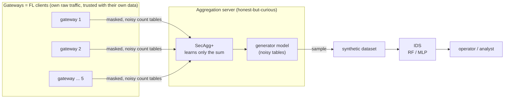
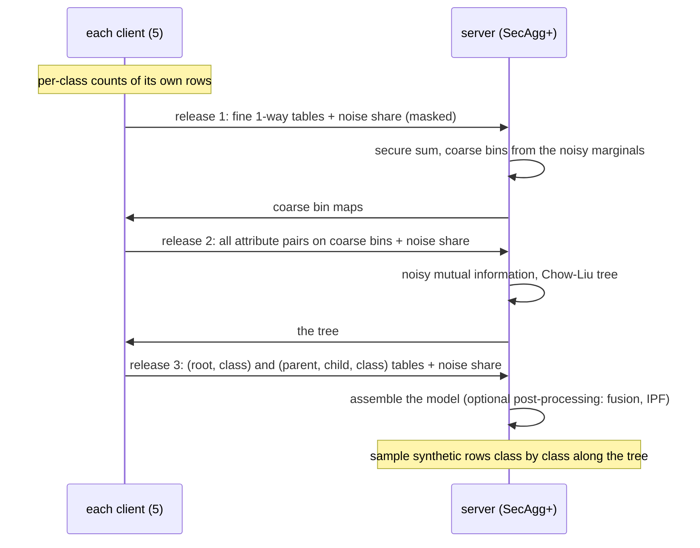
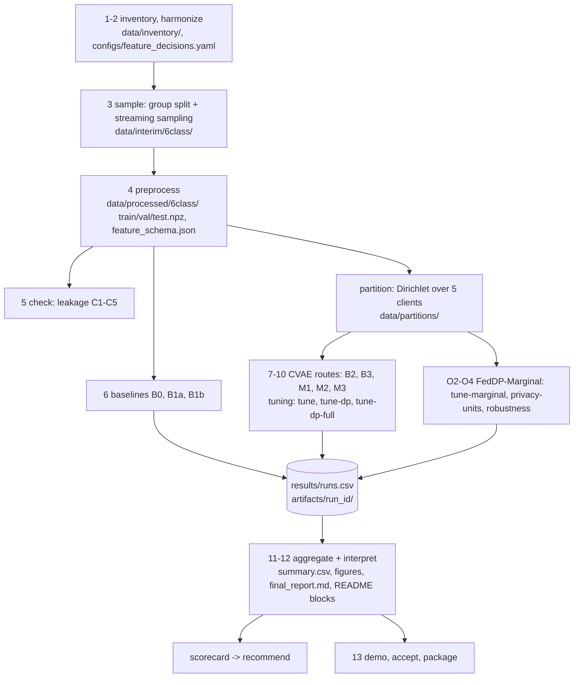
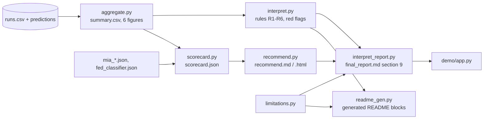

# PP-FedData architecture

**English** | [Tiếng Việt](ARCHITECTURE.vi.md)

This document explains how the repository works: what each component does, how data and results flow between them, where the privacy
protections act, and where each piece lives in the code. Start with the [README](../README.md) for the purpose and the results; come back
here to understand or change the code. Names such as B3, M1, MGs, TSTR are explained in the glossary of the README.

## 1. What the system does

IoT / MQTT gateways each see part of the network traffic. They want a shared intrusion-detection system (IDS), but they cannot pool
their raw packets. PP-FedData lets them build a **synthetic dataset together** instead: every gateway contributes only noisy, aggregated
statistics, and the IDS is trained on data sampled from those statistics. The repository contains the framework, the full experimental
study that evaluates it, and the tools that turn the study into a report, a configuration guide and a demo.



**Threat model.** The server follows the protocol but may look at everything it receives. Secure aggregation hides each gateway's
contribution from it; differential privacy (DP) bounds what the released result (tables, synthetic data, model) reveals about any one
record. By default every gateway is assumed to add its share of the noise; the epsilon that holds when only h gateways do is reported, and
the noise can be calibrated for a minimum number t of honest gateways.

## 2. Two generator routes

| | **FedDP-Marginal** (the framework's generator) | **Federated CVAE** (the baseline of the spec) |
|---|---|---|
| What is shared | count tables (sums), 3 releases | model weights, 30 FedAvg rounds |
| Where DP noise is added | on each client's tables (Skellam or Gaussian share), once per release | on each client's gradients (DP-SGD, Opacus), every step |
| Secure aggregation | Flower SecAgg+, integer sums exact (uint32) | Flower SecAgg+ on the quantised weights (M2, M3) |
| Distributed DP (noise split over clients) | yes (each release is a single sum) | not for DP-SGD (many local steps); only the DP-FedSGD variant M3f, in-process simulation |
| Code | `models/marginal.py`, `fl/mg_app.py` | `models/cvae.py`, `fl/core.py`, `fl/app.py`, `fl/dp_utils.py`, `fl/secagg.py` |
| Configurations | MGs, MGr, MGd, MGl, MGb (+ `-strm`, `-cap`, `-t` options) | B2, B3, M1, M2, M3 (+ M1o, M3o, M3f) |

The CVAE route was the premise of the spec; under DP it stayed far from its non-DP version, so the framework moved to FedDP-Marginal
(report section 9.9b). Both routes share the data preparation, the partition, the evaluation and the reporting.

### One FedDP-Marginal run



The privacy budget is split over the three releases (`split` in `configs/best_marginal.yaml`). Accounting: zCDP for Gaussian noise,
Rényi DP for Skellam noise (Agarwal, Kairouz, Liu 2021), converted to (ε, δ) with δ = 1e-5. Post-processing of released tables costs no ε.
Group-level options (`group_dp.py`): a TCP stream or a capture is the protected unit, held by one client and capped at m rows, so the
sensitivity grows by m. Threshold option: each client adds 1/t of the variance, so ε holds with any t honest clients.

## 3. Pipeline, stage by stage

Every stage is one CLI command (`python -m ppfeddata.cli <command>`, list in the README). Long stages checkpoint and resume.



| Layer | Stages | Code | Reads | Writes |
|---|---|---|---|---|
| Data preparation | Phases 1-4 | `data/inventory.py`, `data/harmonize.py`, `data/split_sample.py`, `data/parse_multi.py`, `data/preprocess.py` | raw CSV (`paths.raw_root`) | `data/inventory/`, `data/interim/<mode>/`, `data/processed/<mode>/`, `results/manifests/` |
| Checks | Phase 5 | `checks/leakage.py`, `checks/leakage_report.py` | processed data | `results/reports/leakage_report.md` |
| Federation | Phases 8-10, O2-O4, P1 | `partition.py`, `fl/*`, `group_dp.py` | processed train split | `data/partitions/`, `artifacts/<config>_<seed>/` |
| Generators | Phases 7-10, O1-O3 | `models/cvae.py`, `models/train.py`, `models/generate.py`, `models/marginal.py`, `models/marginal_bn.py` | client data or tables | `synthetic.npz`, model files |
| Evaluation | Phase 6 onward | `eval/utility.py`, `eval/fidelity.py`, `eval/privacy.py`, `eval/overhead.py`, `eval/stats.py`, `eval/runs.py` | synthetic data, real val / test | `results/runs.csv`, `artifacts/<run_id>/preds/` |
| Experiment control | Phase 11 | `run_experiment.py`, `tune*.py`, `privacy_units.py`, `robustness.py`, `sensitivity.py` | `configs/exp/*.yaml`, `configs/best_*.yaml` | runs, `configs/best_*.yaml` |
| Analysis | Phases 11-12, O0, O4 | `aggregate.py`, `interpret.py`, `interpret_report.py`, `eval/compare.py`, `eval/dp_check.py`, `scorecard.py`, `recommend.py`, `limitations.py` | ledger, predictions, JSON results | `results/summary.csv`, `results/*.json`, `results/reports/*.md`, `results/figures/` |
| Delivery | Phase 13 | `readme_gen.py`, `demo_lib.py`, `demo/app.py`, `acceptance.py`, `package.py` | everything in `results/` | README blocks, demo, `dod_checklist.md`, `results/repro/` |

## 4. Data

- **Source:** the DoS-DDoS-MQTT-IoT dataset (59.6 million packet rows, about 13 GB of CSV exports), not in the repository. Its path is
  set in `configs/local.yaml` or `PPFEDDATA_RAW_ROOT`.
- **Unit:** one row = one packet; 6 classes (NORMAL, BCF, DELAYED, SYN, INVALID, WILL); an 11-class mode separates DoS and DDoS.
- **Split:** train / val / test by **capture group**, so test groups are never seen in training; quotas per class; the test split is used
  only for final numbers, every choice is made on validation.
- **Features:** numeric (standardised), binary, NA flags and one-hot categories; the layout is recorded in `feature_schema.json` and used
  by every generator and classifier.
- **Clients:** the train split is divided over K = 5 clients with a per-class Dirichlet(α = 0.5), so most clients miss some attack
  classes (non-IID). Group-level DP uses a partition that keeps each stream / capture with one client.

## 5. Evaluation

Every generator is judged by what an IDS trained on its data achieves on the **real test split**:

- **Protocols:** TSTR (synthetic only), TAug (real + synthetic), TAugR (real + synthetic for rare classes), against TRTR references
  (B0 real only, B1a class weights, B1b SMOTE). Classifiers: Random Forest and MLP; the scorecard picks the classifier on validation.
- **Metrics:** macro-F1 (main), binary F1 (attack or not), recall of the rare classes, with stratified bootstrap intervals and paired
  comparisons (`eval/stats.py`, `eval/compare.py`).
- **Fidelity:** Wasserstein / Jensen-Shannon distances, correlation distance, C2ST (`eval/fidelity.py`).
- **Privacy:** reported ε (recomputed independently by `eval/dp_check.py`), membership-inference attacks on the synthetic data
  (`eval/privacy.py`) and on the released model (`mia_model.py`, `mia_marginal.py`) with positive controls.
- **Cost:** time and bytes per round, total bytes, peak RAM (`eval/overhead.py`).

Each run writes one row per (configuration, protocol, classifier, seed) to `results/runs.csv` and its test predictions to
`artifacts/<run_id>/preds/`; a finished run is skipped when the command is repeated.

## 6. From runs to conclusions



- **Rules, not prose:** the report's verdicts (R1-R6, red flags F1-F5) are computed by fixed rules in `interpret.py`; every sentence
  that states a number is generated, so the report and the README cannot drift from the results.
- **Scorecard and recommendation:** `scorecard.py` puts every configuration on the same metrics and finds the Pareto front;
  `recommend.py` filters it by a deployment requirement (server trusted or not, honest clients, ε budget, bandwidth, privacy unit,
  priority) and picks from the front. The example IoT scenarios are listed in `results/reports/recommend.md`.
- **Acceptance and reproducibility:** `acceptance.py` checks the spec's Definition of Done against the files (`dod_checklist.md`);
  `package.py` writes `results/repro/` (pip freeze, configs, environment, SHA-256 of the results).

## 7. Configuration

| File | Role |
|---|---|
| `configs/default.yaml` | every parameter: seeds, paths, split quotas, preprocessing, CVAE, FL (K, rounds, α), DP (ε list, δ), SecAgg, evaluation, thresholds |
| `configs/local.yaml` | machine-specific paths (not committed) |
| `configs/feature_decisions.yaml`, `configs/label_map.yaml` | feature roles approved at Gate G1, class mapping |
| `configs/best_*.yaml` | settings chosen on validation by the tuning commands (CVAE, DP, FedDP-Marginal, group DP) |
| `configs/exp/*.yaml` | the experiment matrix run by `run` (one file per configuration) |

## 8. Code map

```
src/ppfeddata/
  cli.py                 one entry point, one sub-command per stage (lazy imports)
  utils.py               config loading, seeding, hashing, logging
  data/                  Phases 1-4: inventory, harmonize, split_sample, parse_multi, preprocess
  checks/                Phase 5: leakage checks and report
  eval/                  Phase 6: baselines, utility, fidelity, privacy, overhead, stats, compare, dp_check, runs, taug_rare
  models/                cvae, train, generate, b2, benchmark (CVAE); marginal, marginal_bn (FedDP-Marginal)
  fl/                    core (FedAvg), app + run (Flower), dp_utils, dp_stats, secagg, bandwidth, dpfedsgd, b3, m1, m2, mg_app
  partition.py           Dirichlet split over clients
  group_dp.py            stream / capture units for group-level DP
  run_experiment.py      the experiment matrix (trial / full)
  tune*.py               hyper-parameter and setting searches (validation only)
  privacy_units.py       group-level DP and honest-client threshold (P1)
  ids_followup.py        IDS-side options, local augmentation (P2)
  robustness.py, sensitivity.py   other federations, other splits
  fed_classifier.py, fed_protected.py   the IDS itself trained by FL (alternative route)
  mia_model.py, mia_marginal.py         membership attacks on released models
  aggregate.py, interpret.py, interpret_report.py, limitations.py   results -> report
  scorecard.py, recommend.py            scorecard and per-requirement guide
  readme_gen.py, demo_lib.py, acceptance.py, package.py             delivery
```

Each folder with code or results has its own README: [`src/ppfeddata/`](../src/ppfeddata/README.md), [`configs/`](../configs/README.md),
[`results/`](../results/README.md), [`tests/`](../tests/README.md), [`demo/`](../demo/README.md).

## 9. Design rules worth knowing before changing code

- **Validation decides, test reports.** Every choice (hyper-parameters, bins, options, classifier) is made on the validation split with
  the mean of 3 seeds; the test split only reports.
- **Everything resumes.** Runs are keyed by a run id and a config hash; a finished run is skipped, so commands can be repeated safely.
- **Generated text only.** Do not edit `results/reports/*.md` or the generated README blocks by hand: change the generator and run
  `aggregate` (or the stage's command).
- **One process per FL run.** Flower simulations run with Ray in their own process (`fl/run.py`, `fl/mg_app.py`); do not run other
  heavy jobs at the same time on a small machine.
- **Every deviation is logged.** A change of method goes to `SPEC_DEVIATIONS.md` with its evidence; the spec keeps only the rules.

## 10. Extending

- **A new generator:** produce `synthetic.npz` in the encoded space of `feature_schema.json`, then call the shared evaluation
  (`privacy_units.final` or `tune_marginal` show the pattern); give it a configuration name that `scorecard.py` can parse.
- **A new deployment scenario:** add a `Requirement` to `SCENARIOS` in `recommend.py`; run `scorecard`, `recommend`, `aggregate`.
- **A new report section:** add a function in `interpret_report.py` that reads a JSON in `results/`, and a test.
