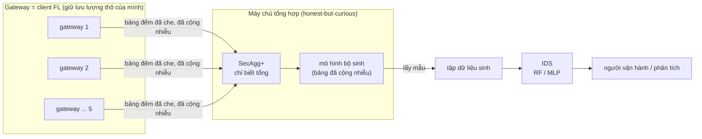
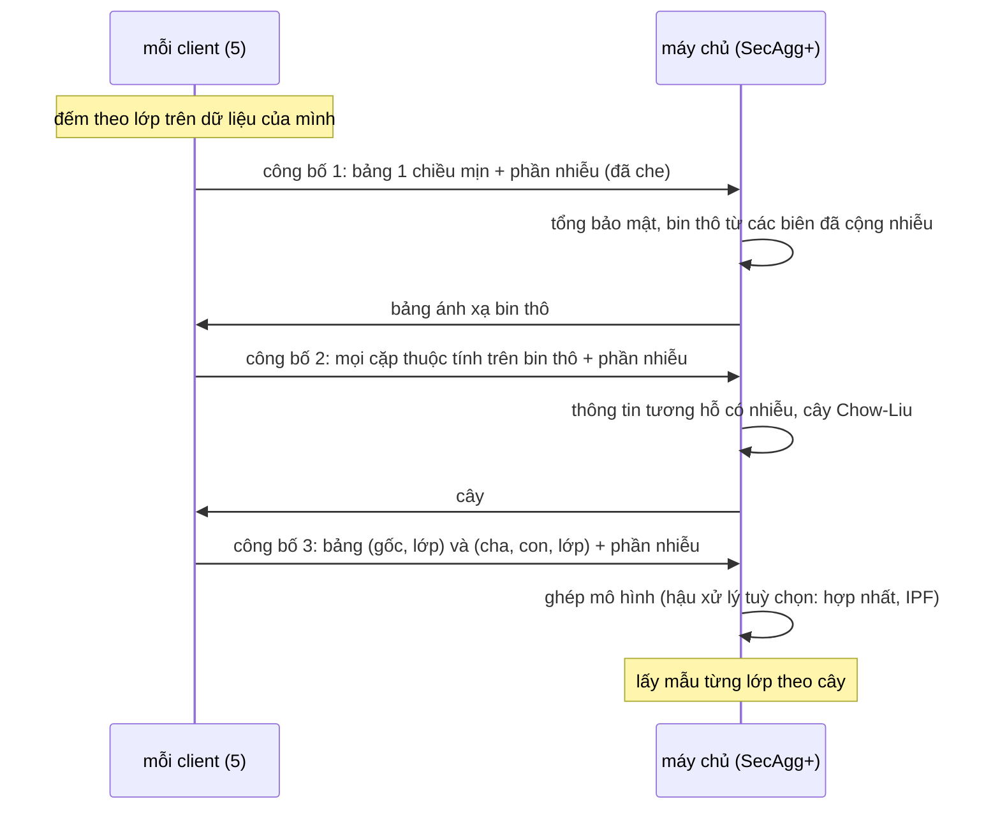
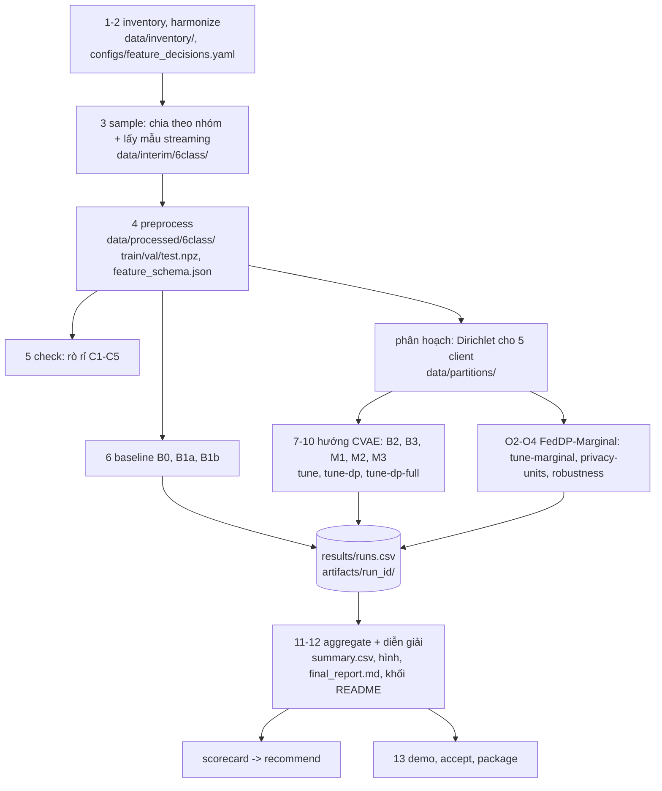
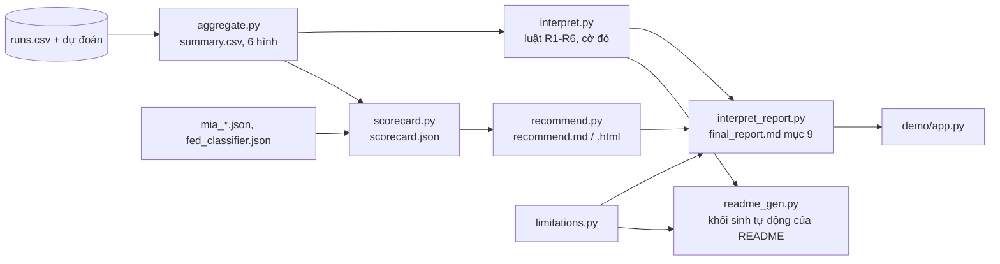

# Kiến trúc PP-FedData

[English](ARCHITECTURE.md) | **Tiếng Việt**

Tài liệu này giải thích repo hoạt động thế nào: mỗi thành phần làm gì, dữ liệu và kết quả đi giữa chúng ra sao, các cơ chế bảo vệ quyền
riêng tư tác động ở đâu, và mỗi phần nằm ở đâu trong mã. Đọc [README](../README.vi.md) trước để biết mục đích và kết quả; quay lại đây
khi cần hiểu hoặc sửa mã. Các tên như B3, M1, MGs, TSTR được giải thích trong bảng thuật ngữ của README.

## 1. Hệ thống làm gì

Mỗi gateway IoT / MQTT chỉ thấy một phần lưu lượng mạng. Các gateway muốn có chung một hệ phát hiện xâm nhập (IDS) nhưng không được gộp
gói tin thô. PP-FedData cho phép chúng **cùng tạo một tập dữ liệu sinh**: mỗi gateway chỉ đóng góp thống kê đã cộng nhiễu và đã gộp, IDS
được huấn luyện trên dữ liệu lấy mẫu từ các thống kê đó. Repo gồm khung sinh dữ liệu, toàn bộ nghiên cứu thực nghiệm đánh giá nó, và các
công cụ biến nghiên cứu thành báo cáo, hướng dẫn chọn cấu hình và demo.



**Mô hình đe dọa.** Máy chủ làm đúng giao thức nhưng có thể xem mọi thứ nó nhận. Tổng hợp bảo mật (secure aggregation) che phần đóng góp
của từng gateway; quyền riêng tư vi sai (DP) giới hạn những gì kết quả công bố (bảng, dữ liệu sinh, mô hình) để lộ về một bản ghi. Mặc
định mọi gateway đều thêm phần nhiễu của mình; ε khi chỉ h gateway làm vậy được báo cáo, và nhiễu có thể hiệu chỉnh cho số gateway trung
thực tối thiểu t.

## 2. Hai hướng sinh dữ liệu

| | **FedDP-Marginal** (bộ sinh của khung) | **CVAE liên kết** (đối chứng của spec) |
|---|---|---|
| Thứ được chia sẻ | bảng đếm (tổng), 3 lần công bố | trọng số mô hình, 30 vòng FedAvg |
| Nhiễu DP thêm ở đâu | trên bảng của mỗi client (phần nhiễu Skellam hoặc Gaussian), một lần mỗi lần công bố | trên gradient của mỗi client (DP-SGD, Opacus), mỗi bước |
| Tổng hợp bảo mật | Flower SecAgg+, tổng số nguyên chính xác (uint32) | Flower SecAgg+ trên trọng số đã lượng tử hoá (M2, M3) |
| DP phân tán (chia nhiễu cho client) | có (mỗi lần công bố là một tổng) | không với DP-SGD (nhiều bước cục bộ); chỉ biến thể DP-FedSGD M3f, mô phỏng trong tiến trình |
| Mã | `models/marginal.py`, `fl/mg_app.py` | `models/cvae.py`, `fl/core.py`, `fl/app.py`, `fl/dp_utils.py`, `fl/secagg.py` |
| Cấu hình | MGs, MGr, MGd, MGl, MGb (+ tuỳ chọn `-strm`, `-cap`, `-t`) | B2, B3, M1, M2, M3 (+ M1o, M3o, M3f) |

Hướng CVAE là tiền đề của spec; dưới DP nó cách xa phiên bản không DP, nên khung chuyển sang FedDP-Marginal (mục 9.9b của báo cáo). Hai
hướng dùng chung phần chuẩn bị dữ liệu, phân hoạch client, đánh giá và báo cáo.

### Một lần chạy FedDP-Marginal



Ngân sách quyền riêng tư được chia cho ba lần công bố (`split` trong `configs/best_marginal.yaml`). Kế toán: zCDP cho nhiễu Gaussian, Rényi
DP cho nhiễu Skellam (Agarwal, Kairouz, Liu 2021), đổi sang (ε, δ) với δ = 1e-5. Hậu xử lý bảng đã công bố không tốn ε. Tuỳ chọn mức nhóm
(`group_dp.py`): một TCP stream hoặc một capture là đơn vị bảo vệ, do một client giữ và tối đa m dòng, nên độ nhạy tăng theo m. Tuỳ chọn
ngưỡng: mỗi client thêm 1/t phương sai, nên ε đúng khi có bất kỳ t client trung thực.

## 3. Đường ống, từng bước

Mỗi bước là một lệnh CLI (`python -m ppfeddata.cli <lệnh>`, danh sách trong README). Các bước dài đều lưu checkpoint và chạy tiếp được.



| Tầng | Bước | Mã | Đọc | Ghi |
|---|---|---|---|---|
| Chuẩn bị dữ liệu | Phase 1-4 | `data/inventory.py`, `data/harmonize.py`, `data/split_sample.py`, `data/parse_multi.py`, `data/preprocess.py` | CSV thô (`paths.raw_root`) | `data/inventory/`, `data/interim/<mode>/`, `data/processed/<mode>/`, `results/manifests/` |
| Kiểm tra | Phase 5 | `checks/leakage.py`, `checks/leakage_report.py` | dữ liệu đã xử lý | `results/reports/leakage_report.md` |
| Liên kết | Phase 8-10, O2-O4, P1 | `partition.py`, `fl/*`, `group_dp.py` | tập train đã xử lý | `data/partitions/`, `artifacts/<config>_<seed>/` |
| Bộ sinh | Phase 7-10, O1-O3 | `models/cvae.py`, `models/train.py`, `models/generate.py`, `models/marginal.py`, `models/marginal_bn.py` | dữ liệu hoặc bảng của client | `synthetic.npz`, tệp mô hình |
| Đánh giá | từ Phase 6 | `eval/utility.py`, `eval/fidelity.py`, `eval/privacy.py`, `eval/overhead.py`, `eval/stats.py`, `eval/runs.py` | dữ liệu sinh, val / test thật | `results/runs.csv`, `artifacts/<run_id>/preds/` |
| Điều phối thí nghiệm | Phase 11 | `run_experiment.py`, `tune*.py`, `privacy_units.py`, `robustness.py`, `sensitivity.py` | `configs/exp/*.yaml`, `configs/best_*.yaml` | các lần chạy, `configs/best_*.yaml` |
| Phân tích | Phase 11-12, O0, O4 | `aggregate.py`, `interpret.py`, `interpret_report.py`, `eval/compare.py`, `eval/dp_check.py`, `scorecard.py`, `recommend.py`, `limitations.py` | sổ chạy, dự đoán, kết quả JSON | `results/summary.csv`, `results/*.json`, `results/reports/*.md`, `results/figures/` |
| Bàn giao | Phase 13 | `readme_gen.py`, `demo_lib.py`, `demo/app.py`, `acceptance.py`, `package.py` | mọi thứ trong `results/` | khối README, demo, `dod_checklist.md`, `results/repro/` |

## 4. Dữ liệu

- **Nguồn:** bộ dữ liệu DoS-DDoS-MQTT-IoT (59,6 triệu dòng gói tin, khoảng 13 GB CSV), không có trong repo. Đường dẫn đặt trong
  `configs/local.yaml` hoặc biến `PPFEDDATA_RAW_ROOT`.
- **Đơn vị:** một dòng = một gói tin; 6 lớp (NORMAL, BCF, DELAYED, SYN, INVALID, WILL); chế độ 11 lớp tách DoS và DDoS.
- **Chia tập:** train / val / test theo **nhóm capture**, nên nhóm của test không bao giờ xuất hiện khi huấn luyện; có hạn mức theo lớp;
  tập test chỉ dùng cho số cuối, mọi lựa chọn đều làm trên val.
- **Đặc trưng:** số (chuẩn hoá), nhị phân, cờ thiếu và one-hot; bố cục ghi trong `feature_schema.json`, dùng chung cho mọi bộ sinh và bộ
  phân loại.
- **Client:** tập train chia cho K = 5 client theo Dirichlet(α = 0,5) từng lớp, nên phần lớn client thiếu một số lớp tấn công (non-IID).
  DP mức nhóm dùng phân hoạch giữ mỗi stream / capture ở một client.

## 5. Đánh giá

Mỗi bộ sinh được chấm bằng kết quả của IDS học trên dữ liệu của nó, đo trên **tập test thật**:

- **Giao thức:** TSTR (chỉ dữ liệu sinh), TAug (thật + sinh), TAugR (thật + sinh cho lớp hiếm), so với mốc TRTR (B0 chỉ dữ liệu thật,
  B1a trọng số lớp, B1b SMOTE). Bộ phân loại: Random Forest và MLP; bảng điểm chọn bộ phân loại trên val.
- **Chỉ số:** macro-F1 (chính), binary F1 (tấn công hay không), recall lớp hiếm, kèm khoảng bootstrap phân tầng và so sánh cặp
  (`eval/stats.py`, `eval/compare.py`).
- **Độ trung thực:** khoảng cách Wasserstein / Jensen-Shannon, khoảng cách tương quan, C2ST (`eval/fidelity.py`).
- **Quyền riêng tư:** ε báo cáo (tính lại độc lập bằng `eval/dp_check.py`), tấn công suy luận thành viên trên dữ liệu sinh
  (`eval/privacy.py`) và trên mô hình công bố (`mia_model.py`, `mia_marginal.py`) có đối chứng dương.
- **Chi phí:** thời gian và byte mỗi vòng, tổng byte, RAM đỉnh (`eval/overhead.py`).

Mỗi lần chạy ghi một dòng cho mỗi (cấu hình, giao thức, bộ phân loại, seed) vào `results/runs.csv` và dự đoán trên test vào
`artifacts/<run_id>/preds/`; lần chạy đã xong được bỏ qua khi chạy lại lệnh.

## 6. Từ lần chạy đến kết luận



- **Luật, không phải văn tay:** các kết luận của báo cáo (R1-R6, cờ đỏ F1-F5) do luật cố định trong `interpret.py` tính; mọi câu có con số
  đều được sinh tự động, nên báo cáo và README không lệch khỏi kết quả.
- **Bảng điểm và khuyến nghị:** `scorecard.py` đặt mọi cấu hình lên cùng các chỉ số và tìm mặt Pareto; `recommend.py` lọc theo yêu cầu
  triển khai (có tin máy chủ không, số client trung thực, ngân sách ε, băng thông, đơn vị bảo vệ, ưu tiên) rồi chọn trên mặt đó. Các kịch
  bản IoT mẫu nằm trong `results/reports/recommend.md`.
- **Nghiệm thu và tái lập:** `acceptance.py` đối chiếu danh mục nghiệm thu của spec với các tệp (`dod_checklist.md`); `package.py` ghi
  `results/repro/` (pip freeze, cấu hình, môi trường, SHA-256 của kết quả).

## 7. Cấu hình

| Tệp | Vai trò |
|---|---|
| `configs/default.yaml` | mọi tham số: seed, đường dẫn, hạn mức chia tập, tiền xử lý, CVAE, FL (K, số vòng, α), DP (danh sách ε, δ), SecAgg, đánh giá, ngưỡng |
| `configs/local.yaml` | đường dẫn riêng của máy (không commit) |
| `configs/feature_decisions.yaml`, `configs/label_map.yaml` | vai trò đặc trưng duyệt ở Gate G1, ánh xạ lớp |
| `configs/best_*.yaml` | thiết lập chọn trên val bởi các lệnh tune (CVAE, DP, FedDP-Marginal, DP mức nhóm) |
| `configs/exp/*.yaml` | ma trận thí nghiệm của lệnh `run` (mỗi cấu hình một tệp) |

## 8. Bản đồ mã

```
src/ppfeddata/
  cli.py                 một điểm vào, mỗi bước một lệnh con (import khi cần)
  utils.py               đọc cấu hình, seed, hash, log
  data/                  Phase 1-4: inventory, harmonize, split_sample, parse_multi, preprocess
  checks/                Phase 5: kiểm tra rò rỉ và báo cáo
  eval/                  Phase 6: baselines, utility, fidelity, privacy, overhead, stats, compare, dp_check, runs, taug_rare
  models/                cvae, train, generate, b2, benchmark (CVAE); marginal, marginal_bn (FedDP-Marginal)
  fl/                    core (FedAvg), app + run (Flower), dp_utils, dp_stats, secagg, bandwidth, dpfedsgd, b3, m1, m2, mg_app
  partition.py           chia Dirichlet cho client
  group_dp.py            đơn vị stream / capture cho DP mức nhóm
  run_experiment.py      ma trận thí nghiệm (trial / full)
  tune*.py               tìm siêu tham số và thiết lập (chỉ trên val)
  privacy_units.py       DP mức nhóm và ngưỡng client trung thực (P1)
  ids_followup.py        tuỳ chọn phía IDS, tăng cường cục bộ (P2)
  robustness.py, sensitivity.py   liên kết khác, cách chia khác
  fed_classifier.py, fed_protected.py   chính IDS huấn luyện bằng FL (hướng thay thế)
  mia_model.py, mia_marginal.py         tấn công suy luận thành viên lên mô hình công bố
  aggregate.py, interpret.py, interpret_report.py, limitations.py   kết quả -> báo cáo
  scorecard.py, recommend.py            bảng điểm và hướng dẫn theo yêu cầu
  readme_gen.py, demo_lib.py, acceptance.py, package.py             bàn giao
```

Mỗi thư mục có mã hoặc kết quả có README riêng (tiếng Anh): [`src/ppfeddata/`](../src/ppfeddata/README.md), [`configs/`](../configs/README.md),
[`results/`](../results/README.md), [`tests/`](../tests/README.md), [`demo/`](../demo/README.md).

## 9. Quy tắc thiết kế cần biết trước khi sửa mã

- **Val quyết định, test báo cáo.** Mọi lựa chọn (siêu tham số, bin, tuỳ chọn, bộ phân loại) làm trên val bằng trung bình 3 seed; tập
  test chỉ để báo cáo.
- **Mọi thứ chạy tiếp được.** Lần chạy được định danh bằng run id và config hash; lần chạy đã xong được bỏ qua, nên chạy lại lệnh an toàn.
- **Chỉ văn bản sinh tự động.** Không sửa tay `results/reports/*.md` hay các khối sinh tự động của README: sửa hàm sinh rồi chạy
  `aggregate` (hoặc lệnh của bước đó).
- **Mỗi lần chạy FL một tiến trình.** Mô phỏng Flower chạy với Ray trong tiến trình riêng (`fl/run.py`, `fl/mg_app.py`); trên máy nhỏ không
  chạy việc nặng khác cùng lúc.
- **Mọi chỗ lệch đều được ghi.** Thay đổi phương pháp ghi vào `SPEC_DEVIATIONS.md` kèm bằng chứng; spec chỉ giữ luật.

## 10. Mở rộng

- **Bộ sinh mới:** tạo `synthetic.npz` trong không gian mã hoá của `feature_schema.json`, rồi gọi phần đánh giá chung (`privacy_units.final`
  hoặc `tune_marginal` là mẫu); đặt tên cấu hình mà `scorecard.py` đọc được.
- **Kịch bản triển khai mới:** thêm một `Requirement` vào `SCENARIOS` trong `recommend.py`; chạy `scorecard`, `recommend`, `aggregate`.
- **Mục báo cáo mới:** thêm một hàm trong `interpret_report.py` đọc một JSON trong `results/`, kèm test.
