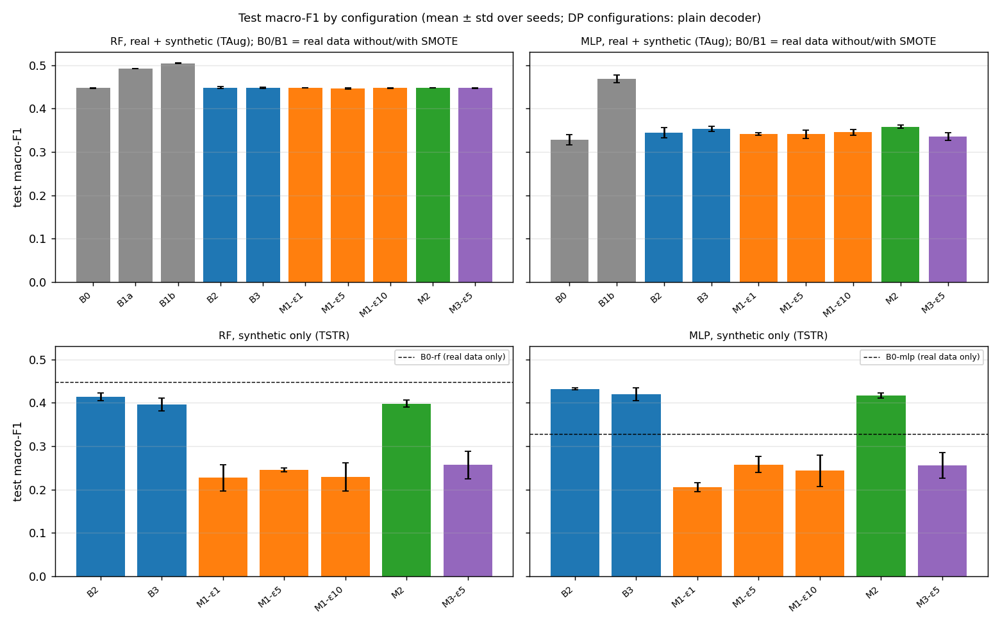
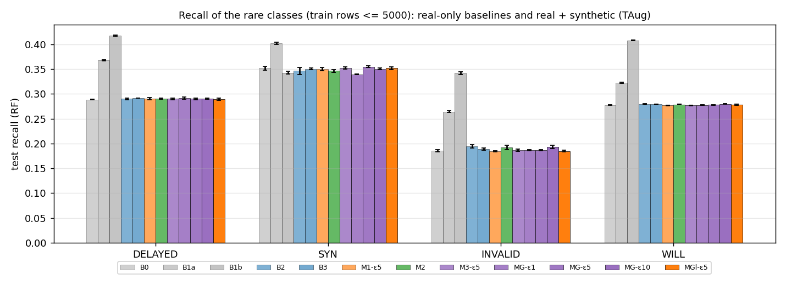
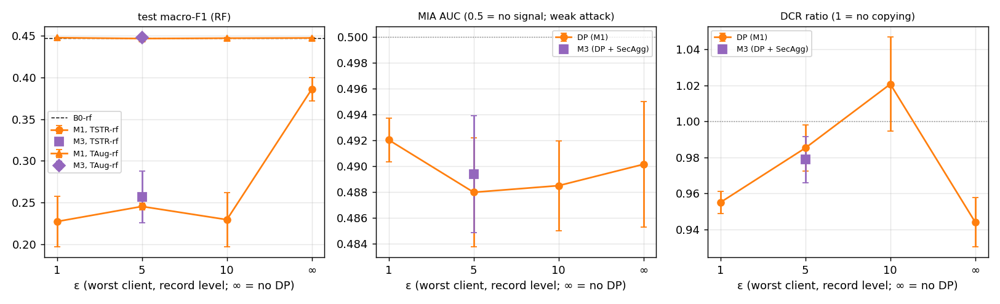
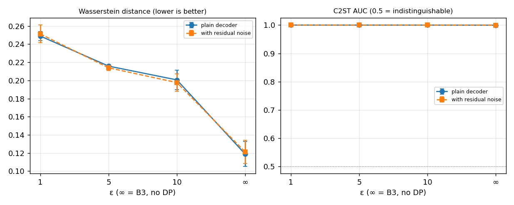
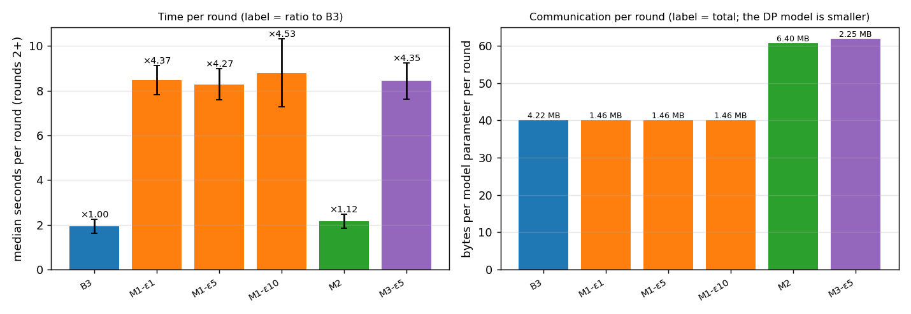
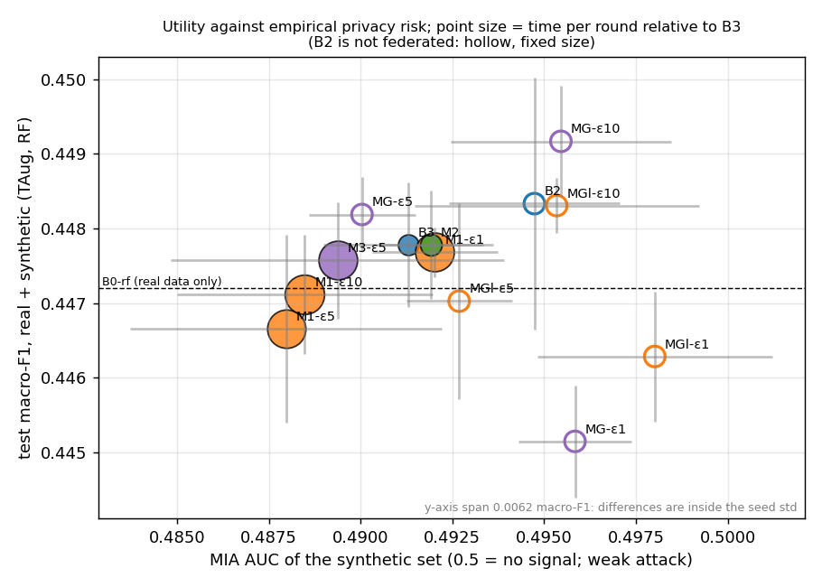

# PP-FedData - final report (6class)

Auto-generated by `ppfeddata aggregate` from the run ledger (`results/runs.csv`), the FL round logs and the config; no number is typed by hand. Seeds [0, 1, 2]; 263 ledger rows (93 configurations). Utility is measured on the real test split. DP configurations are shown with the **plain decoder**, the variant that depends only on the DP-trained weights and is covered by epsilon (epsilon = worst client, record level, delta 1e-05); B3 at epsilon = infinity is B3-plain. The headline DP family is M1d-t21 / M3d-t21 (hyper-parameters searched under DP-SGD, SPEC_DEVIATIONS 9.11-9.14). Section 9 applies the interpretation rules of Phase 12 (answers R1-R6, red flags, recommendation).

## 1. Provenance and completeness

Status of the spec matrix in this ledger (done = every expected ledger row exists with its predictions):

| configuration | title | seed 0 | seed 1 | seed 2 |
|---|---|---|---|---|
| B0 | Real data only (RF and MLP) | done | done | done |
| B1a | class_weight balanced (RF) | done | done | done |
| B1b | SMOTE oversampling (RF and MLP) | done | done | done |
| B2 | Centralised CVAE | done | done | done |
| B3 | CVAE + FedAvg (non-IID) | done | done | done |
| M2 | FedAvg + SecAgg+ | done | done | done |
| M1-eps1 | FedAvg + DP-SGD, epsilon 1 (DP-tuned hyper-parameters) | done | done | done |
| M1-eps5 | FedAvg + DP-SGD, epsilon 5 (DP-tuned hyper-parameters) | done | done | done |
| M1-eps10 | FedAvg + DP-SGD, epsilon 10 (DP-tuned hyper-parameters) | done | done | done |
| M3 | FedAvg + DP-SGD (epsilon 5) + SecAgg+ | done | done | done |

Every configuration was produced with one config hash and one git commit across its seeds. The hashes below differ between phases because the config file grew (new keys for later phases, none of them read by the earlier methods); `ppfeddata run --stage trial` re-runs the whole matrix from scratch under one commit and compares it with these rows (`results/reports/g4_trial.md`). **Reproduction check:** the isolated one-seed trial (seed [0]) re-ran the matrix from scratch and reproduced 53 of 53 ledger rows exactly (largest difference of a result metric 0.0e+00; byte counts of SecAgg runs differ by up to 33 bytes because they depend on random keys).

| config hash | git commit | ledger configurations | methods |
|---|---|---|---|
| 88a491bd4f2b | 5c730f4 | 60 | B3, M1 |
| 88a491bd4f2b | a5f4447 | 4 | B3 |
| 88a491bd4f2b | df582a6 | 4 | B2 |
| 9481b098ba11 | 49ace43 | 5 | B0, B1a, B1b |
| d94d6fe867ac | 1fbdcd1 | 12 | M2, M3 |
| d94d6fe867ac | 252df9f | 8 | A1 |

Libraries installed when this report was generated: torch 2.14.1, flwr 1.39.0, opacus 1.6.0, ray 2.59.0, scikit-learn 1.9.1, numpy 2.3.2, pandas 2.3.1, optuna 5.0.0, imbalanced-learn 0.14.2.

Rows per class [train, val, test] (quotas; the splits are by capture group, see leakage_report.md):

| class | train | val | test |
|---|---|---|---|
| NORMAL | 60000 | 2000 | 5000 |
| BCF | 20000 | 2000 | 5000 |
| DELAYED | 3000 | 2000 | 5000 |
| SYN | 3000 | 2000 | 5000 |
| INVALID | 1500 | 2000 | 5000 |
| WILL | 1000 | 2000 | 5000 |

## 2a. Utility, RF (test macro-F1, mean ± std over seeds)

| configuration | real-only / SMOTE | TSTR (synthetic only) | TAug (real + synthetic) | balanced acc (TAug / baseline) |
|---|---|---|---|---|
| B0 | 0.4472 ± 0.0010 | - | - | 0.4830 ± 0.0007 |
| B1a | 0.4921 ± 0.0003 | - | - | 0.5177 ± 0.0003 |
| B1b | 0.5043 ± 0.0009 | - | - | 0.5215 ± 0.0007 |
| B2 | - | 0.4133 ± 0.0093 | 0.4483 ± 0.0017 | 0.4836 ± 0.0014 |
| B3 | - | 0.3961 ± 0.0146 | 0.4478 ± 0.0008 | 0.4832 ± 0.0006 |
| M1-eps1 | - | 0.2270 ± 0.0303 | 0.4477 ± 0.0003 | 0.4832 ± 0.0003 |
| M1-eps5 | - | 0.2451 ± 0.0039 | 0.4467 ± 0.0013 | 0.4825 ± 0.0009 |
| M1-eps10 | - | 0.2293 ± 0.0327 | 0.4471 ± 0.0008 | 0.4830 ± 0.0006 |
| M2 | - | 0.3979 ± 0.0083 | 0.4478 ± 0.0007 | 0.4831 ± 0.0004 |
| M3-eps5 | - | 0.2565 ± 0.0313 | 0.4476 ± 0.0008 | 0.4832 ± 0.0007 |

## 2b. Utility, MLP (test macro-F1, mean ± std over seeds)

| configuration | real-only / SMOTE | TSTR (synthetic only) | TAug (real + synthetic) | balanced acc (TAug / baseline) |
|---|---|---|---|---|
| B0 | 0.3282 ± 0.0114 | - | - | 0.4069 ± 0.0044 |
| B1b | 0.4687 ± 0.0085 | - | - | 0.4860 ± 0.0066 |
| B2 | - | 0.4318 ± 0.0024 | 0.3448 ± 0.0117 | 0.4137 ± 0.0066 |
| B3 | - | 0.4199 ± 0.0145 | 0.3536 ± 0.0057 | 0.4146 ± 0.0045 |
| M1-eps1 | - | 0.2050 ± 0.0102 | 0.3411 ± 0.0029 | 0.4089 ± 0.0046 |
| M1-eps5 | - | 0.2576 ± 0.0183 | 0.3411 ± 0.0094 | 0.4120 ± 0.0043 |
| M1-eps10 | - | 0.2432 ± 0.0365 | 0.3453 ± 0.0071 | 0.4144 ± 0.0018 |
| M2 | - | 0.4166 ± 0.0060 | 0.3582 ± 0.0042 | 0.4174 ± 0.0019 |
| M3-eps5 | - | 0.2556 ± 0.0297 | 0.3355 ± 0.0082 | 0.4097 ± 0.0025 |

## 3. Recall of the rare classes (DELAYED, SYN, INVALID, WILL; RF, real + synthetic or baseline)

| configuration | DELAYED | SYN | INVALID | WILL |
|---|---|---|---|---|
| B0 | 0.289 ± 0.000 | 0.352 ± 0.004 | 0.186 ± 0.002 | 0.278 ± 0.001 |
| B1a | 0.368 ± 0.001 | 0.402 ± 0.002 | 0.264 ± 0.002 | 0.322 ± 0.001 |
| B1b | 0.418 ± 0.001 | 0.343 ± 0.002 | 0.342 ± 0.003 | 0.408 ± 0.000 |
| B2 | 0.290 ± 0.001 | 0.346 ± 0.007 | 0.194 ± 0.004 | 0.279 ± 0.001 |
| B3 | 0.292 ± 0.000 | 0.350 ± 0.001 | 0.189 ± 0.002 | 0.279 ± 0.001 |
| M1-eps1 | 0.291 ± 0.001 | 0.351 ± 0.002 | 0.188 ± 0.001 | 0.277 ± 0.000 |
| M1-eps5 | 0.290 ± 0.002 | 0.350 ± 0.003 | 0.184 ± 0.001 | 0.277 ± 0.001 |
| M1-eps10 | 0.291 ± 0.002 | 0.354 ± 0.002 | 0.184 ± 0.002 | 0.276 ± 0.001 |
| M2 | 0.290 ± 0.001 | 0.346 ± 0.003 | 0.192 ± 0.004 | 0.279 ± 0.000 |
| M3-eps5 | 0.290 ± 0.002 | 0.352 ± 0.002 | 0.187 ± 0.002 | 0.277 ± 0.001 |

All classes:

| configuration | NORMAL | BCF | DELAYED | SYN | INVALID | WILL |
|---|---|---|---|---|---|---|
| B0 | 0.975 ± 0.000 | 0.820 ± 0.000 | 0.289 ± 0.000 | 0.352 ± 0.004 | 0.186 ± 0.002 | 0.278 ± 0.001 |
| B1a | 0.949 ± 0.001 | 0.801 ± 0.000 | 0.368 ± 0.001 | 0.402 ± 0.002 | 0.264 ± 0.002 | 0.322 ± 0.001 |
| B1b | 0.950 ± 0.001 | 0.669 ± 0.001 | 0.418 ± 0.001 | 0.343 ± 0.002 | 0.342 ± 0.003 | 0.408 ± 0.000 |
| B2 | 0.974 ± 0.000 | 0.817 ± 0.001 | 0.290 ± 0.001 | 0.346 ± 0.007 | 0.194 ± 0.004 | 0.279 ± 0.001 |
| B3 | 0.974 ± 0.001 | 0.816 ± 0.000 | 0.292 ± 0.000 | 0.350 ± 0.001 | 0.189 ± 0.002 | 0.279 ± 0.001 |
| M1-eps1 | 0.974 ± 0.000 | 0.819 ± 0.001 | 0.291 ± 0.001 | 0.351 ± 0.002 | 0.188 ± 0.001 | 0.277 ± 0.000 |
| M1-eps5 | 0.975 ± 0.000 | 0.819 ± 0.001 | 0.290 ± 0.002 | 0.350 ± 0.003 | 0.184 ± 0.001 | 0.277 ± 0.001 |
| M1-eps10 | 0.974 ± 0.000 | 0.817 ± 0.001 | 0.291 ± 0.002 | 0.354 ± 0.002 | 0.184 ± 0.002 | 0.276 ± 0.001 |
| M2 | 0.975 ± 0.000 | 0.817 ± 0.001 | 0.290 ± 0.001 | 0.346 ± 0.003 | 0.192 ± 0.004 | 0.279 ± 0.000 |
| M3-eps5 | 0.975 ± 0.000 | 0.819 ± 0.001 | 0.290 ± 0.002 | 0.352 ± 0.002 | 0.187 ± 0.002 | 0.277 ± 0.001 |

## 4. Privacy: epsilon achieved and empirical checks

The formal guarantee is epsilon (record level, packets of one TCP stream are correlated, labels are not protected; SecAgg adds no accounting). The duplicate rate, the DCR ratio and the membership-inference AUC are empirical checks of the synthetic set; the MIA only detects near-copies (positive control in b2_cvae.md), so 0.5 means 'no copying', not 'no leakage'.

| configuration | target eps | eps achieved (max / median over clients) | duplicate rate | DCR ratio | MIA AUC |
|---|---|---|---|---|---|
| B2 | - | - | 0.0002 ± 0.0001 | 0.9505 ± 0.0077 | 0.4947 ± 0.0023 |
| B3 | - | - | 0.0001 ± 0.0000 | 0.9496 ± 0.0240 | 0.4913 ± 0.0023 |
| M1-eps1 | 1 | 0.997 ± 0.000 / 0.994 ± 0.002 | 0.0000 ± 0.0000 | 0.9551 ± 0.0061 | 0.4920 ± 0.0017 |
| M1-eps5 | 5 | 4.998 ± 0.001 / 4.994 ± 0.001 | 0.0000 ± 0.0001 | 0.9853 ± 0.0129 | 0.4880 ± 0.0042 |
| M1-eps10 | 10 | 9.998 ± 0.001 / 9.994 ± 0.002 | 0.0001 ± 0.0001 | 1.0207 ± 0.0261 | 0.4885 ± 0.0035 |
| M2 | - | - | 0.0002 ± 0.0001 | 0.9479 ± 0.0133 | 0.4919 ± 0.0014 |
| M3-eps5 | 5 | 4.998 ± 0.001 / 4.994 ± 0.001 | 0.0001 ± 0.0000 | 0.9788 ± 0.0128 | 0.4894 ± 0.0045 |

Thresholds from the config (heuristics to be confirmed by the user): duplicate rate <= 0.01, DCR ratio >= 0.5, MIA AUC <= 0.55.

## 5. Fidelity of the synthetic set (mean over classes)

C2ST AUC close to 1 means a classifier tells synthetic from real rows almost perfectly (threshold in the config: <= 0.95); the mean-squared-error decoder reproduces discrete columns as continuous values (SPEC_DEVIATIONS 7.1, 7.6), so this holds for every generator, DP or not.

| configuration | Wasserstein | JS | correlation distance | C2ST AUC |
|---|---|---|---|---|
| B2 | 0.1523 ± 0.0205 | 0.0051 ± 0.0021 | 0.0703 ± 0.0020 | 0.9996 ± 0.0000 |
| B3 | 0.1213 ± 0.0129 | 0.0035 ± 0.0017 | 0.0684 ± 0.0084 | 0.9998 ± 0.0001 |
| M1-eps1 | 0.2489 ± 0.0050 | 0.0160 ± 0.0016 | 0.1692 ± 0.0005 | 1.0000 ± 0.0000 |
| M1-eps5 | 0.2158 ± 0.0008 | 0.0116 ± 0.0004 | 0.1457 ± 0.0059 | 0.9999 ± 0.0001 |
| M1-eps10 | 0.2006 ± 0.0109 | 0.0101 ± 0.0008 | 0.1379 ± 0.0030 | 0.9999 ± 0.0000 |
| M2 | 0.1243 ± 0.0162 | 0.0035 ± 0.0016 | 0.0709 ± 0.0111 | 0.9998 ± 0.0000 |
| M3-eps5 | 0.2151 ± 0.0021 | 0.0116 ± 0.0004 | 0.1458 ± 0.0052 | 0.9999 ± 0.0000 |

## 6. Cost

Time per round is the median of rounds 2+ of the FL round logs (round 1 includes starting Ray), averaged over seeds. Bytes per round: plain FL = float32 model x clients x 2; SecAgg = counted on the grid (all four protocol stages). The DP-tuned model (hidden 128-64) is smaller than the B3 / M2 model (hidden 256-128), so compare bytes per parameter, and compare M2 with B3 and M3 with M1. Overhead threshold in the config: 3.0x the plain FL round.

| configuration | median s/round (rounds 2+) | ratio to B3 | bytes/round | bytes/param/round |
|---|---|---|---|---|
| B3 | 1.94 | 1.00 | 4,222,560 | 40.0 |
| M1-eps1 | 8.46 | 4.37 | 1,457,760 | 40.0 |
| M1-eps5 | 8.28 | 4.27 | 1,457,760 | 40.0 |
| M1-eps10 | 8.79 | 4.53 | 1,457,760 | 40.0 |
| M2 | 2.16 | 1.12 | 6,399,836 | 60.6 |
| M3-eps5 | 8.43 | 4.35 | 2,252,614 | 61.8 |

## 7. DP configurations: plain decoder against the variant with residual noise

The residual-noise scales are computed from the pooled train data and are not covered by epsilon (SPEC_DEVIATIONS 8.8, 9.4); the gap shows how much utility depends on that statistic.

| configuration | TSTR-rf plain | TSTR-rf with residual noise (not covered by eps) | TAug-rf plain | TAug-rf with residual noise |
|---|---|---|---|---|
| M1-eps1 | 0.2270 ± 0.0303 | 0.2680 ± 0.0370 | 0.4477 ± 0.0003 | 0.4475 ± 0.0011 |
| M1-eps5 | 0.2451 ± 0.0039 | 0.2787 ± 0.0295 | 0.4467 ± 0.0013 | 0.4470 ± 0.0010 |
| M1-eps10 | 0.2293 ± 0.0327 | 0.2914 ± 0.0188 | 0.4471 ± 0.0008 | 0.4475 ± 0.0009 |
| M3-eps5 | 0.2565 ± 0.0313 | 0.2943 ± 0.0276 | 0.4476 ± 0.0008 | 0.4473 ± 0.0003 |

## 8. Reference rows (not in the spec matrix)

B3-plain is the epsilon = infinity point; the Phase 7 family used hyper-parameters tuned without DP and a clipping bound of 1 (SPEC_DEVIATIONS 9.5); it is kept to show what the DP-specific search changed.

| configuration | TSTR-rf | TSTR-mlp | TAug-rf | TAug-mlp | eps achieved (max) |
|---|---|---|---|---|---|
| B3-plain (eps = inf) | 0.3859 ± 0.0140 | 0.3883 ± 0.0125 | 0.4474 ± 0.0006 | 0.3485 ± 0.0101 | - |
| M1 Phase 7 hp, eps 1 | 0.2009 ± 0.0418 | 0.2006 ± 0.0441 | 0.4481 ± 0.0012 | 0.3432 ± 0.0023 | 0.999 ± 0.001 |
| M1 Phase 7 hp, eps 5 | 0.1890 ± 0.0118 | 0.1851 ± 0.0182 | 0.4474 ± 0.0002 | 0.3397 ± 0.0097 | 4.998 ± 0.001 |
| M1 Phase 7 hp, eps 10 | 0.1978 ± 0.0465 | 0.1967 ± 0.0511 | 0.4472 ± 0.0012 | 0.3416 ± 0.0088 | 9.998 ± 0.001 |

## 8b. Extension A1: label skew of the clients (Dirichlet alpha)

B3 with another Dirichlet alpha and everything else equal (5 clients, 30 rounds x 2 local epochs, the same hyper-parameters, no DP, no SecAgg). Every seed draws its own partition, so the spread over seeds includes the partition draw. Macro-F1 on the real test split.

| Dirichlet alpha | TSTR-rf | TSTR-mlp | TAug-rf | TAug-mlp |
|---|---|---|---|---|
| 0.1 | 0.3316 ± 0.0211 | 0.3472 ± 0.0274 | 0.4478 ± 0.0006 | 0.3463 ± 0.0083 |
| 0.5 (B3) | 0.3961 ± 0.0146 | 0.4199 ± 0.0145 | 0.4478 ± 0.0008 | 0.3536 ± 0.0057 |
| 10 | 0.4132 ± 0.0053 | 0.4216 ± 0.0100 | 0.4472 ± 0.0009 | 0.3503 ± 0.0048 |

Generator and training side of the same runs. alpha changes more than the label mix: with a skewed split the clients also differ in size, and a larger client takes more optimiser steps and carries more FedAvg weight (SPEC_DEVIATIONS 8.6), so the effective number of steps per round differs between rows.

| Dirichlet alpha | seeds | client rows, min - max over seeds | effective optimiser steps / round | FL final val loss (ELBO) | C2ST AUC | Wasserstein | TSTR-rf recall, mean over DELAYED/SYN/INVALID/WILL |
|---|---|---|---|---|---|---|---|
| 0.1 | 3 | 917 - 71,140 | 356 | 3.6170 ± 0.6269 | 0.9998 ± 0.0001 | 0.1441 ± 0.0148 | 0.290 ± 0.087 |
| 0.5 (B3) | 3 | 2,862 - 69,578 | 308 | 2.3148 ± 0.6962 | 0.9998 ± 0.0001 | 0.1213 ± 0.0129 | 0.336 ± 0.007 |
| 10 | 3 | 11,832 - 21,931 | 144 | 1.8134 ± 0.0517 | 0.9994 ± 0.0001 | 0.1232 ± 0.0078 | 0.348 ± 0.033 |

## 9. Interpretation (Phase 12)

Generated by `ppfeddata aggregate` (module `interpret.py`) from the run ledger and the test-set predictions saved by every run (147 runs, seeds [0, 1, 2], 30,000 real test rows). The rules are those of the spec (Phase 12); the choices it leaves open are recorded in SPEC_DEVIATIONS 12.1-12.10. Every number is recomputed from those files (the macro-F1 recomputed from the predictions equals the ledger's to 8e-17); `results/interpretation.json` holds the same numbers in machine-readable form.

**How a difference is judged.** Every comparison is a difference of test macro-F1 (or of recall) between two configurations, averaged over the 3 seeds (delta = first minus second). A difference *has an effect* only if (i) its 95 % paired-bootstrap interval excludes 0 and (ii) |delta| is larger than the seed-to-seed std of the two configurations (the larger of the two, ddof = 0, as in every table). The bootstrap draws the 30,000 real test rows with replacement, stratified by class, with the same 1000 resamples for every run, so the differences are paired. Packets of one TCP stream are correlated, which makes that interval too narrow; every verdict is therefore repeated with a bootstrap over whole streams (20,343 streams) and marked **†** when the verdict changes. Neither interval reflects which capture files form the test split (11 capture groups; sensitivity A4 was not run) or training randomness beyond the seeds that were run, so a verdict is a statement about this test split and these seeds.

### 9.0 Answers at a glance

- **R1 - Does synthetic data improve the IDS?** Short answer: RF: no generator passes the rule (SMOTE +0.057); MLP: 6 of 7 generators pass, the best by +0.030 (SMOTE +0.140). Test macro-F1, real + synthetic minus real only: RF: 0 of 7 generators better, 7 no effect, 0 worse (delta -0.0005 to +0.0011); MLP: 6 of 7 generators better, 1 no effect, 0 worse (delta +0.0073 to +0.0300). Recall of the rare classes (DELAYED/SYN/INVALID/WILL, RF) moves by at most 0.009 for any generator, against +0.063 to +0.102 (mean of the four) for the SMOTE / class-weight references. Reference macro-F1 deltas: B1a +0.045 (RF), B1b +0.057 (RF), B1b +0.140 (MLP).
- **R2 - Is the CVAE better than the simple methods?** No. TAug with the CVAE (B2, B3) against class weights (B1a, RF) and SMOTE (B1b): 6 of 6 comparisons worse, 0 no effect, 0 better (macro-F1 delta -0.1239 to -0.0438; rare-class recall delta -0.175 to -0.062).
- **R3 - What does non-IID FL cost?** B2 minus B3 in test macro-F1: TSTR-RF +0.0172, TSTR-MLP +0.0119, TAug-RF +0.0006, TAug-MLP -0.0088. Relative loss in TSTR-RF: 4.2 %. Reported only; the spec sets no pass / fail threshold.
- **R4 - What does DP cost, and what does it bring?** Cost, plain decoder against the epsilon = infinity point: TSTR macro-F1 delta -0.1834 to -0.1308 (6 of 6 comparisons worse), TAug delta -0.0074 to +0.0003 (6 of 6 no effect). Over epsilon = 1, 5, 10 the TSTR-RF curve is monotone within noise and flat (range 0.018 against seed std up to 0.033). Benefit: no empirical benefit is measurable. MIA AUC is 0.488-0.492 at every epsilon including infinity (spread 0.004), it does not approach 0.5 as epsilon shrinks, and the attack did not detect an over-fitted CVAE (AUC 0.519), so the positive control of the spec is not met for the CVAE. What DP brings is the formal guarantee (record level, see 9.8).
- **R5 - What does SecAgg cost?** Utility (M2 - B3 and M3 - M1-eps5, 8 comparisons): 8 no effect, 0 better, 0 worse (largest |delta| 0.0113); the differences are inside the seed noise. Overhead: M2 / B3: 1.12x time per round, 1.52x bytes per parameter per round; M3-eps5 / M1-eps5: 1.02x time per round, 1.55x bytes per parameter per round.
- **R6 - Recommended configuration.** Rule: MIA AUC <= 0.55, epsilon <= 5 when DP is used, time per round <= 3x plain FL (B3), then the highest TAug macro-F1 (RF). Eligible: B3, M2. The literal rule picks B3; tied within noise: B3, M2; the tie is broken in favour of the stronger protection: **M2**. DP configurations fail the overhead filter (M1-eps1 4.37x, M1-eps5 4.27x, M1-eps10 4.53x, M3-eps5 4.35x), not utility or MIA: every candidate's TAug-RF macro-F1 lies in 0.4467-0.4483. If a formal DP guarantee is required, the DP option the rule would pick without the overhead filter is M1-eps1 (tied: M1-eps1, M1-eps5, M3-eps5).
- **Which of M1, M2, M3 for which requirement?** Utility does not decide it (the TAug-RF macro-F1 of every candidate lies in 0.4467-0.4483); what each one protects and what it costs does (9.10). **M2** if only the aggregation server must not see the updates (1.12x time per round, 1.52x bytes per parameter, utility: 4 of 4 comparisons with B3 show no effect; no epsilon); **M1-eps1** if a formal guarantee on the released model or synthetic data is required (TSTR macro-F1 -47 to -34 % against epsilon = infinity, recall of the rare classes 0.11-0.13 against 0.31, 4.3-4.5x time per round; the three epsilons are indistinguishable in utility, so the smallest costs no more here); **M3-eps5** if both are needed (on top of M1-eps5: 1.02x time, 1.55x bytes per parameter, 4 of 4 utility comparisons show no effect). These are costs and guarantees, not a measured privacy benefit: the empirical attack is at chance for every configuration (R4).
- **Why a CVAE at all?** R1 and R2 do not support the CVAE as a way to improve the IDS (worse than class weights and SMOTE in 6 of 6 comparisons; generators better than real data only: RF 0 of 7, at most +0.001 against +0.057 for SMOTE, MLP 6 of 7, at most +0.030 against +0.140 for SMOTE). The CVAE is the premise of the spec (a federated, label-conditional generator whose data balance the classes of the IDS), not the outcome of a comparison between generators, and this study is its test. What is left of the case is the setting where raw data cannot be pooled, which TAug, B0 and B1 all need: there the synthetic data alone give RF 0.396 (B3), 0.398 (M2) against 0.447 for real data only, without pooling the raw data. Not tested, so the CVAE is not shown to be the best option even there: training the classifier itself by FL, federated class weights or SMOTE, other generators. See 9.9.
- **Red flags** (spec Phase 12): F1 (macro-F1 near 1.00, B0 included): not triggered; F2 (TSTR above TRTR): TRIGGERED, investigated: not above the class-balanced real reference; F3 (model copies training data): not triggered; F4 (large spread between seeds): TRIGGERED (only in rows outside the spec matrix) - more seeds or a stability check; F5 (reported epsilon far from an independent recomputation): not triggered. Details in 9.7.

### 9.1 R1 - Does synthetic data improve the IDS?

Delta = test macro-F1 of real + synthetic training data (TAug) minus real data only (B0). B1a (class weights) and B1b (SMOTE) are non-generative references; DP rows use the plain decoder. **†** = the stream bootstrap gives another verdict.

| configuration | RF: delta macro-F1 [95% CI] | RF: seed std | RF: verdict | MLP: delta macro-F1 [95% CI] | MLP: seed std | MLP: verdict |
|---|---|---|---|---|---|---|
| B1a (reference) | +0.0449 [+0.0414, +0.0480] | 0.0010 | better | - | - | - |
| B1b (reference) | +0.0571 [+0.0533, +0.0611] | 0.0010 | better | +0.1405 [+0.1354, +0.1449] | 0.0114 | better |
| B2 | +0.0011 [-0.0001, +0.0024] | 0.0017 | no effect | +0.0166 [+0.0146, +0.0186] | 0.0117 | better |
| B3 | +0.0006 [-0.0006, +0.0018] | 0.0010 | no effect | +0.0254 [+0.0228, +0.0278] | 0.0114 | better |
| M1-eps1 | +0.0005 [-0.0005, +0.0015] | 0.0010 | no effect | +0.0129 [+0.0108, +0.0150] | 0.0114 | better |
| M1-eps5 | -0.0005 [-0.0015, +0.0005] | 0.0013 | no effect | +0.0129 [+0.0112, +0.0146] | 0.0114 | better |
| M1-eps10 | -0.0001 [-0.0012, +0.0009] | 0.0010 | no effect | +0.0171 [+0.0151, +0.0191] | 0.0114 | better |
| M2 | +0.0006 [-0.0006, +0.0018] | 0.0010 | no effect | +0.0300 [+0.0274, +0.0324] | 0.0114 | better |
| M3-eps5 | +0.0004 [-0.0007, +0.0014] | 0.0010 | no effect | +0.0073 [+0.0058, +0.0088] | 0.0114 | no effect |

Recall of the rare classes (DELAYED, SYN, INVALID, WILL), RF: delta TAug - B0 and verdict ('=' = no effect):

| configuration | DELAYED | SYN | INVALID | WILL | mean of the four [95% CI] |
|---|---|---|---|---|---|
| B1a (reference) | +0.080 better | +0.050 better | +0.079 better | +0.045 better | +0.063 [+0.059, +0.067] better |
| B1b (reference) | +0.129 better | -0.009 worse † | +0.157 better | +0.130 better | +0.102 [+0.097, +0.106] better |
| B2 | +0.002 = | -0.005 = | +0.009 better | +0.002 = | +0.002 [+0.000, +0.003] = |
| B3 | +0.003 better | -0.001 = | +0.003 better | +0.001 = | +0.002 [+0.000, +0.003] better † |
| M1-eps1 | +0.002 better | -0.001 = | +0.002 = | -0.001 = | +0.001 [-0.000, +0.002] = |
| M1-eps5 | +0.002 = | -0.002 = | -0.001 = | -0.001 = | -0.000 [-0.001, +0.001] = |
| M1-eps10 | +0.003 better | +0.002 = | -0.001 = | -0.001 = | +0.001 [-0.000, +0.002] = |
| M2 | +0.002 = | -0.006 worse † | +0.007 better | +0.001 = | +0.001 [-0.000, +0.002] = |
| M3-eps5 | +0.001 = | +0.000 = | +0.001 = | -0.001 = | +0.001 [-0.000, +0.002] = |

Recall of the rare classes (DELAYED, SYN, INVALID, WILL), MLP: delta TAug - B0 and verdict ('=' = no effect):

| configuration | DELAYED | SYN | INVALID | WILL | mean of the four [95% CI] |
|---|---|---|---|---|---|
| B1b (reference) | +0.272 better | -0.039 worse | +0.312 better | +0.216 better | +0.190 [+0.185, +0.195] better |
| B2 | +0.012 better | +0.005 = | +0.043 better | +0.002 better | +0.015 [+0.014, +0.017] better |
| B3 | +0.010 = | -0.062 worse | +0.121 better | +0.004 better | +0.018 [+0.016, +0.021] better |
| M1-eps1 | -0.005 = | -0.023 = | +0.065 better | +0.001 = | +0.009 [+0.008, +0.011] better |
| M1-eps5 | +0.006 = | -0.020 = | +0.049 better | -0.001 = | +0.009 [+0.007, +0.010] better |
| M1-eps10 | -0.001 = | -0.020 = | +0.073 better | +0.004 better | +0.014 [+0.012, +0.016] better |
| M2 | +0.023 better | -0.045 worse | +0.116 better | +0.003 better | +0.024 [+0.022, +0.027] better |
| M3-eps5 | +0.003 = | -0.008 = | +0.028 = | -0.000 = | +0.006 [+0.004, +0.007] = |

### 9.2 R2 - Is the CVAE better than the simple methods?

Delta = TAug macro-F1 of the CVAE (B2 centralised, B3 federated) minus the simple method trained on the same real data (B1a: class weights, RF only; B1b: SMOTE to the same per-class target). R1 and R2 do not favour the CVAE as an augmentation method; section 9.9 explains why the study uses it and what is left of the case.

| CVAE | compared with | delta macro-F1 [95% CI] | seed std | verdict | delta rare-class recall [95% CI] | verdict (recall) |
|---|---|---|---|---|---|---|
| B2 | B1a-RF | -0.0438 [-0.0468, -0.0402] | 0.0017 | worse | -0.062 [-0.065, -0.058] | worse |
| B2 | B1b-RF | -0.0560 [-0.0600, -0.0523] | 0.0017 | worse | -0.100 [-0.105, -0.096] | worse |
| B2 | B1b-MLP | -0.1239 [-0.1287, -0.1186] | 0.0117 | worse | -0.175 [-0.181, -0.169] | worse |
| B3 | B1a-RF | -0.0443 [-0.0474, -0.0409] | 0.0008 | worse | -0.062 [-0.065, -0.058] | worse |
| B3 | B1b-RF | -0.0566 [-0.0605, -0.0529] | 0.0009 | worse | -0.100 [-0.104, -0.096] | worse |
| B3 | B1b-MLP | -0.1151 [-0.1196, -0.1100] | 0.0085 | worse | -0.172 [-0.177, -0.167] | worse |

### 9.3 R3 - What does non-IID federated training cost?

B2 (centralised CVAE) minus B3 (the same CVAE trained with FedAvg over 5 non-IID clients). Positive = the centralised generator is better. The spec asks to report the loss, with no pass / fail threshold; the verdict column applies the rule of this section for information.

| protocol / classifier | B2 | B3 | B2 - B3 [95% CI] | relative loss of B3 | seed std | verdict (information only) |
|---|---|---|---|---|---|---|
| TSTR-RF | 0.4133 | 0.3961 | +0.0172 [+0.0141, +0.0203] | +4.2 % | 0.0146 | better |
| TSTR-MLP | 0.4318 | 0.4199 | +0.0119 [+0.0091, +0.0146] | +2.7 % | 0.0145 | no effect |
| TAug-RF | 0.4483 | 0.4478 | +0.0006 [-0.0004, +0.0016] | +0.1 % | 0.0017 | no effect |
| TAug-MLP | 0.3448 | 0.3536 | -0.0088 [-0.0117, -0.0056] | -2.5 % | 0.0117 | no effect |

### 9.4 R4 - What does DP cost, and what does it bring?

**Cost.** Delta = test macro-F1 of the DP generator (plain decoder, epsilon = worst client) minus B3-plain, the epsilon = infinity point with the same decoder.

| configuration | TSTR-RF | TSTR-MLP | TAug-RF | TAug-MLP |
|---|---|---|---|---|
| M1-eps1 | -0.1589 [-0.1632, -0.1543] worse | -0.1834 [-0.1882, -0.1787] worse | +0.0003 [-0.0009, +0.0015] no effect | -0.0074 [-0.0097, -0.0051] no effect |
| M1-eps5 | -0.1408 [-0.1453, -0.1362] worse | -0.1308 [-0.1356, -0.1258] worse | -0.0007 [-0.0019, +0.0004] no effect | -0.0074 [-0.0096, -0.0052] no effect |
| M1-eps10 | -0.1567 [-0.1606, -0.1527] worse | -0.1452 [-0.1501, -0.1404] worse | -0.0003 [-0.0013, +0.0009] no effect | -0.0032 [-0.0053, -0.0012] no effect |

**Empirical privacy and generator quality against epsilon** (mean ± std over seeds; the validation ELBO is each run's own, with its own architecture and beta, so compare the infinity row with the others only roughly):

| epsilon | achieved (max over clients and seeds) | MIA AUC | DCR ratio | duplicate rate | validation ELBO (FL final) |
|---|---|---|---|---|---|
| infinity (B3-plain) | - | 0.4901 ± 0.0049 | 0.9440 ± 0.0137 | 0.00050 ± 0.00019 | 2.31 ± 0.70 |
| 10 | 9.999 | 0.4885 ± 0.0035 | 1.0207 ± 0.0261 | 0.00008 ± 0.00006 | 6.97 ± 2.68 |
| 5 | 4.999 | 0.4880 ± 0.0042 | 0.9853 ± 0.0129 | 0.00004 ± 0.00006 | 5.93 ± 1.16 |
| 1 | 0.997 | 0.4920 ± 0.0017 | 0.9551 ± 0.0061 | 0.00000 ± 0.00000 | 8.35 ± 3.07 |

**Shape of the utility-privacy curve** (a step to a larger epsilon that is worse by more than the larger seed std of the two points would break monotonicity):

| curve | eps 1 | eps 5 | eps 10 | monotone within noise | range | largest seed std | flat (range <= std) |
|---|---|---|---|---|---|---|---|
| TSTR-rf | 0.227 ± 0.030 | 0.245 ± 0.004 | 0.229 ± 0.033 | yes | 0.018 | 0.033 | yes |
| TSTR-mlp | 0.205 ± 0.010 | 0.258 ± 0.018 | 0.243 ± 0.037 | yes | 0.053 | 0.037 | no |
| validation ELBO (lower is better) | 8.350 ± 3.067 | 5.931 ± 1.156 | 6.966 ± 2.675 | yes | 2.419 | 3.067 | yes |

**Membership inference.** The AUC is within 0.5 ± 0.05 at every epsilon, infinity included (spread 0.0041); the gap to 0.5 is 0.0099 at epsilon = infinity and 0.0080 at the smallest epsilon, against a seed std of 0.0049, so the AUC does not approach 0.5 as epsilon shrinks (it is already there).

Positive control (b2_cvae.md): on a CVAE over-fitted on 498 members the attack reaches AUC 0.519 (threshold 0.55), so it **does not detect an over-fitted CVAE**; the spec's condition 'MIA AUC approaches 0.5 as epsilon shrinks, after passing the positive control' cannot be established with this attack. On a pure copier of the members it reaches (noise 0: 0.977, noise 0.05: 0.669, noise 0.2: 0.532, noise 0.5: 0.506). An AUC near 0.5 therefore says only that no synthetic row is a near-copy of a training row.

### 9.5 R5 - What does secure aggregation cost?

Utility: SecAgg aggregates the updates up to a quantisation error of the order 1e-5 per aggregation, so a difference in the table is not a systematic effect of the protocol; it comes from the sensitivity of the training to perturbations of that size (SPEC_DEVIATIONS 10.4, controls in m2_m3_secagg.md). The criterion is that the difference stays inside the seed noise ('no effect').

| pair | protocol / classifier | delta macro-F1 [95% CI] | seed std | verdict |
|---|---|---|---|---|
| M2 - B3 | TSTR-RF | +0.0018 [-0.0008, +0.0045] | 0.0146 | no effect |
| M2 - B3 | TSTR-MLP | -0.0033 [-0.0057, -0.0010] | 0.0145 | no effect |
| M2 - B3 | TAug-RF | -0.0000 [-0.0010, +0.0010] | 0.0008 | no effect |
| M2 - B3 | TAug-MLP | +0.0046 [+0.0027, +0.0062] | 0.0057 | no effect |
| M3-eps5 - M1-eps5 | TSTR-RF | +0.0113 [+0.0088, +0.0138] | 0.0313 | no effect |
| M3-eps5 - M1-eps5 | TSTR-MLP | -0.0019 [-0.0039, +0.0001] | 0.0297 | no effect |
| M3-eps5 - M1-eps5 | TAug-RF | +0.0009 [+0.0000, +0.0018] | 0.0013 | no effect |
| M3-eps5 - M1-eps5 | TAug-MLP | -0.0056 [-0.0074, -0.0037] | 0.0094 | no effect |

Overhead (single-machine simulation: compute and bytes are measured, network latency is not):

| pair | median s/round | time ratio | bytes / parameter / round | bytes ratio |
|---|---|---|---|---|
| M2 / B3 | 2.16 vs 1.94 | 1.12 | 60.6 vs 40.0 | 1.52 |
| M3-eps5 / M1-eps5 | 8.43 vs 8.28 | 1.02 | 61.8 vs 40.0 | 1.55 |

### 9.6 R6 - Recommended configuration

Rule (spec Phase 12; thresholds from the config): among the configurations with MIA AUC <= 0.55, epsilon (max over clients and seeds) <= 5 when DP is used and time per round <= 3x plain FL (B3), choose the highest TAug macro-F1 (RF, mean over seeds). Two additions that the spec does not state (SPEC_DEVIATIONS 12.5): B2 trains on pooled data, so it is shown but cannot be eligible in a study of federated generation; configurations whose TAug macro-F1 is not worse than the best one by the rule of this section count as tied, and a tie is broken in favour of the stronger formal protection (finite epsilon, the smaller the better; then SecAgg).

| configuration | TAug-RF | TSTR-RF | MIA AUC | epsilon (max) | time / round vs B3 | MIA <= 0.55 | eps <= 5 | overhead <= 3x | eligible |
|---|---|---|---|---|---|---|---|---|---|
| B2 | 0.4483 | 0.4133 | 0.495 | - | n/a (not federated) | yes | yes | yes | no (pooled data) |
| B3 | 0.4478 | 0.3961 | 0.491 | - | 1.00 | yes | yes | yes | yes |
| M1-eps1 | 0.4477 | 0.2270 | 0.492 | 0.997 | 4.37 | yes | yes | NO | NO |
| M1-eps5 | 0.4467 | 0.2451 | 0.488 | 4.999 | 4.27 | yes | yes | NO | NO |
| M1-eps10 | 0.4471 | 0.2293 | 0.488 | 9.999 | 4.53 | yes | NO | NO | NO |
| M2 | 0.4478 | 0.3979 | 0.492 | - | 1.12 | yes | yes | yes | yes |
| M3-eps5 | 0.4476 | 0.2565 | 0.489 | 4.999 | 4.35 | yes | yes | NO | NO |

**Result.** The literal rule picks **B3** (highest TAug-RF among the eligible). Tied within noise: B3, M2. After the tie-break the recommendation is **M2**; the literal pick leads it by 5.0e-07 in TAug-RF, far inside the seed std.

**How much the ranking says.** The TAug-RF macro-F1 of all candidates lies in 0.4467-0.4483 (real data only, B0-RF: 0.4472); R1 found 0 of 7 generators better than real data only for the RF. The ranking therefore separates the candidates little, and the outcome is decided by the filters and the tie-break. Removed by the overhead filter: M1-eps1, M1-eps5, M1-eps10, M3-eps5; by the epsilon limit: M1-eps10; by the MIA filter: nobody (the attack is at chance for every generator, so it filters nothing).

**If a formal DP guarantee is required.** Dropping only the overhead filter, the rule would pick M1-eps1 (tied within noise: M1-eps1, M1-eps5, M3-eps5); with the tie-break, **M1-eps1**: epsilon 0.997, TAug-RF 0.4477, but TSTR-RF 0.2270 and 4.37x the time per round of B3. If the synthetic data are to be released instead of the real data (the TSTR scenario), the utility column to read is TSTR, not TAug.

**Ranked by TSTR instead of TAug.** When the synthetic data replace the real data, the macro-F1 to rank by is TSTR-RF. The same rule then picks M2 (tied within noise: B3, M2) and, after the tie-break, **M2**: the same recommendation as above.

**What R6 does not say.** R6 ranks the CVAE pipelines against each other; it does not say that a CVAE pipeline is better than not using one. R1 and R2 say it is not when the real training data can be pooled; section 9.9 gives the setting in which the recommendation applies.

### 9.7 Red flags

The spec lists five situations that must be investigated and never reported as success:

| flag | triggered when | status |
|---|---|---|
| F1 macro-F1 near 1.00, B0 included | B0-rf macro-F1 >= 0.95: leakage / artefact, go back to Phase 5 | not triggered |
| F2 TSTR above TRTR | TSTR minus B0 has an effect (interval excludes 0 and abs(delta) > seed std) in favour of TSTR: suspect label leakage through the synthetic data or a misused test set | TRIGGERED, investigated: not above the class-balanced real reference |
| F3 model copies training data | duplicate rate > 0.01 or DCR ratio < 0.5 in any generator and seed | not triggered |
| F4 large spread between seeds | std of macro-F1 over seeds > 0.05 for any configuration | TRIGGERED (only in rows outside the spec matrix) - more seeds or a stability check |
| F5 reported epsilon far from an independent recomputation | relative difference above 0.1 (either sign) between the reported epsilon and the one recomputed with own RDP code, or step counters that match neither the plan nor the loader | not triggered |

**F1** B0 macro-F1: RF 0.4472, MLP 0.3282; the highest macro-F1 of any configuration is 0.5043 (threshold 0.95).

**F2 TSTR above TRTR.** 3 of 14 generator / classifier pairs have TSTR better than B0 by the rule of this section.

| generator | classifier | TSTR - B0 [95% CI] | TSTR - B1b-MLP [95% CI] | recall NORMAL (TSTR - B0) | recall rare classes (TSTR - B0) |
|---|---|---|---|---|---|
| B2 | MLP | +0.1036 [+0.0994, +0.1078] | -0.0369 [-0.0414, -0.0323] worse | -0.171 | +0.159 |
| B3 | MLP | +0.0917 [+0.0875, +0.0960] | -0.0488 [-0.0534, -0.0436] worse | -0.189 | +0.208 |
| M2 | MLP | +0.0884 [+0.0844, +0.0925] | -0.0521 [-0.0569, -0.0467] worse | -0.182 | +0.149 |

Investigation: B0 is trained on the imbalanced real train pool and TSTR on a class-balanced synthetic set, so the fair real counterpart of TSTR is the class-balanced real reference (B1b, SMOTE). In every flagged pair TSTR stays below that reference (table). In every flagged pair the gain over B0 comes with lower NORMAL recall and higher rare-class recall, the signature of class balancing. For the RF, TSTR is worse than B0 in 7 of 7 pairs. The preprocessor and the generators are fitted on the train split, the validation split only stops training and selects hyper-parameters, the test split is never used for fitting or tuning (SPEC_DEVIATIONS 6.4), and the test groups are disjoint from the train groups. Status: not above the class-balanced reference, so no sign of label leakage in this comparison.

TSTR trains on 5000 synthetic rows per class (balanced by construction); B0 trains on the imbalanced real train pool (quota per class: NORMAL 60000, BCF 20000, DELAYED 3000, SYN 3000, INVALID 1500, WILL 1000).

**F3 Copying.** Largest duplicate rate 0.00077 (B3-plain-TSTR-rf, seed 1; limit 0.01); smallest DCR ratio 0.927 (B3-TSTR-rf, seed 1; limit 0.5); 62 generator / seed pairs checked.

**F4 Spread between seeds.** Largest std of macro-F1 over seeds (limit 0.05; softer note level 0.02):

| configuration | mean macro-F1 | std over seeds | in the spec matrix |
|---|---|---|---|
| M1-eps1-TSTR-mlp | 0.2154 | 0.0575 | no (reference or extension) |
| M1-eps10-plain-TSTR-mlp | 0.1967 | 0.0511 | no (reference or extension) |
| M1-eps10-plain-TSTR-rf | 0.1978 | 0.0465 | no (reference or extension) |
| M1-eps1-TSTR-rf | 0.1943 | 0.0445 | no (reference or extension) |
| M1-eps1-plain-TSTR-mlp | 0.2006 | 0.0441 | no (reference or extension) |
| M1-eps1-plain-TSTR-rf | 0.2009 | 0.0418 | no (reference or extension) |

2 of 85 configurations exceed 0.05 (0 of them in the spec matrix); the largest std inside the matrix is 0.0370. 19 configurations exceed 0.02 (by method: 14 M1, 3 M3, 2 A1; by protocol: 19 TSTR). These generators are trained with DP noise (M1, M3) or on very skewed client data (A1, alpha 0.1), and FL training is sensitive to small perturbations (SPEC_DEVIATIONS 10.4). A difference between such rows is not interpretable below the std; more seeds would narrow it (3 seeds is the size the spec asks for).

**F5 Epsilon recomputed independently.** Own implementation of the Renyi-DP accountant of the Sampled Gaussian mechanism (integer orders 2-256, the conversion Opacus uses), from each run's client sizes, noise multipliers, batch size and logged step counters; the tests check it against Opacus' own functions on the same orders (relative difference below 1e-9). 23 DP runs: the largest relative difference to the reported epsilon is 0.69 % (limit 10 %); the independent value is the same or slightly larger because Opacus also searches fractional orders.

| target epsilon | DP runs | reported (min - max) | independent (min - max) | largest relative difference (absolute) |
|---|---|---|---|---|
| 1 | 6 | 0.9964 - 1.0000 | 0.9964 - 1.0000 | 0.00 % |
| 5 | 11 | 4.9961 - 4.9992 | 4.9961 - 5.0337 | 0.69 % |
| 10 | 6 | 9.9966 - 9.9995 | 10.0288 - 10.0612 | 0.62 % |

7 runs have fewer counted DP steps than rounds x epochs x ceil(n/B) for one client: Opacus' Poisson loader has int(1 / sample_rate) batches per epoch and 1 / (1 / 99) = 98.99999999999999 truncates to 98. The report uses the counted steps (and the true sampling rate), so epsilon is right; only the noise calibration was one step per epoch more conservative than needed for that client.

### 9.8 What secure aggregation and differential privacy each protect

- **SecAgg** (M2, M3) hides each client's model update from the aggregation server: an honest-but-curious server sees only the sum of the updates of the clients that took part. It does not limit what the aggregated model, or the synthetic data generated from it, reveals about a training record, and it gives no epsilon (SecAgg+ is not credited with privacy amplification here). It does not defend against a malicious client.
- **DP-SGD** (M1, M3) bounds what the trained weights, and therefore the synthetic data generated from them, reveal about one record of one client: epsilon at the level of a record (a packet), worst case over the clients, delta 1e-5. Packets of one TCP stream and of one capture are correlated, so an entire attack session or capture is protected much less than epsilon suggests (group privacy; the sizes of these units in this sample are in 9.10); the class label that conditions the generator is not protected; the hyper-parameters were tuned on non-private validation data; the residual-noise variants of the decoder use statistics of the pooled train data and are outside epsilon (headline numbers use the plain decoder).
- **M3** combines both: the server cannot see an individual (noisy) update, and the aggregate carries the DP guarantee of the clients' noise.
- The empirical checks (duplicate rate, DCR ratio, membership inference) are weak: they detect near-copies only (section 4), so they cannot replace the formal guarantee, and a C2ST close to 1 shows that the synthetic rows are easy to tell from real ones (SPEC_DEVIATIONS 7.1, 7.6).

### 9.9 Why a CVAE, given R1 and R2

**Where the choice comes from.** The CVAE is the premise of the study, not the outcome of a comparison between generators: the spec (title and 'Idea') asks whether a label-conditional CVAE trained by federated learning on non-IID clients, protected by DP-SGD, secure aggregation or both, can produce data that balance the classes for the IDS classifiers (RF and MLP). R1 and R2 are the test of that premise, and the spec asks for results that run against the expectation to be reported as they are.

**What R1 and R2 say about that premise.** R1 and R2 do not support the premise. RF: 0 of 7 generators better than real data only (delta -0.0005 to +0.0011); MLP: 6 of 7 generators better than real data only (delta +0.0073 to +0.0300); the simple references change macro-F1 by B1a +0.045 (RF), B1b +0.057 (RF), B1b +0.140 (MLP). TAug with the CVAE is worse than class weights and SMOTE in 6 of 6 comparisons (macro-F1 delta -0.1239 to -0.0438). When the real training data can be pooled and the goal is only a better IDS, class weights or SMOTE are the better choice: they use the same real data and need no generator. This is a negative result for the premise on this data, and it is reported as such.

**What the choice can still rest on.** TAug, B0 and B1 all train on the pooled real training data, so none of them is available when raw data cannot leave the clients, the setting of the threat model. There the federated CVAE is the only option of this study that produces data without pooling the raw records, and the question becomes what the synthetic data alone are worth (TSTR) and what protection can be layered on them. The table puts both settings side by side (test macro-F1, mean over seeds).

| setting | option | needs pooled real data | RF macro-F1 | MLP macro-F1 |
|---|---|---|---|---|
| real data can be pooled | B1b (SMOTE) | yes | 0.504 | 0.469 |
| real data can be pooled | B1a (class weights) | yes | 0.492 | - |
| real data can be pooled | B0 (real data only) | yes | 0.447 | 0.328 |
| real data can be pooled | B2 + real data (TAug) | yes | 0.448 | 0.345 |
| real data can be pooled | B3 + real data (TAug) | yes | 0.448 | 0.354 |
| raw data stays at the clients | B3 (synthetic data only, TSTR) | no | 0.396 | 0.420 |
| raw data stays at the clients | M1-eps1 (synthetic data only, TSTR) | no | 0.227 | 0.205 |
| raw data stays at the clients | M1-eps5 (synthetic data only, TSTR) | no | 0.245 | 0.258 |
| raw data stays at the clients | M1-eps10 (synthetic data only, TSTR) | no | 0.229 | 0.243 |
| raw data stays at the clients | M2 (synthetic data only, TSTR) | no | 0.398 | 0.417 |
| raw data stays at the clients | M3-eps5 (synthetic data only, TSTR) | no | 0.256 | 0.256 |

With the synthetic data alone the RF reaches 0.396 (B3) and 0.398 (M2) against 0.447 with real data only (-11 % and -11 %); the MLP is above real data only (0.420 against 0.328), a gap that flag F2 traces to B0 being trained on imbalanced data (it stays below SMOTE, 0.469); DP lowers the synthetic-only macro-F1 by 34-47 % against epsilon = infinity at every epsilon tested (R4).

**Why this generator and not another.** The spec does not compare generators, so this is not a result. What can be said is which properties make the CVAE fit the design: it is label-conditional, so classes can be generated on demand; its parameters form one fixed-size vector, so FedAvg and secure aggregation apply unchanged; it has no BatchNorm, so the per-sample gradients of DP-SGD work in Opacus (spec 7.1; a test checks it); it trains on a CPU: 84 s for the 30 federated rounds of B3 per seed (43 s centralised), 272 s with DP. That a GAN or another generator would be heavier or worse was not measured (the optional WGAN-GP baseline of the spec was not run, SPEC_DEVIATIONS 6.7).

**What this does not show.**

- The synthetic rows are easy to tell from real ones (C2ST AUC 0.9998 for B3; close to 1 for every generator, from 0.9996 to 1.0000; section 5), so fidelity is poor and the premise was tested with a generator of this quality; a generator with better fidelity might behave differently (not tested).
- Privacy: the membership-inference check is at chance for every generator, the non-private B3 included (0.491), and it did not pass its positive control on an over-fitted CVAE, so the study cannot show that the synthetic data leak less than the real data. Only epsilon (M1, M3) gives a guarantee, and it costs 34-47 % of the synthetic-only macro-F1 (R4).
- Not tested: federated training of the IDS classifier itself (for example FedAvg on the MLP), the obvious alternative when raw data cannot be pooled and no synthetic data have to be shared; federated versions of class weighting or SMOTE (B1 ran on pooled real data, so R2 compares with centralised simple methods); other generators (the optional WGAN-GP, TVAE or CTGAN-type models, diffusion); other ways of using the synthetic data than topping every class up to `target_per_class`.

**How to read R6 with this in mind.** R6 ranks the CVAE pipelines against each other; it does not say that a CVAE pipeline is better than not using one. Read R1 to R6 together: (1) the real data can be pooled and the goal is a better IDS: class weights or SMOTE, no generator (RF 0.492 / 0.504 against 0.447 for real data only); (2) the raw data cannot leave the clients and data must be generated or shared: a federated CVAE, **M2** by the rule of 9.6, or M1-eps1 if a formal guarantee is required, accepting a synthetic-only macro-F1 below that of real data.

### 9.10 Which configuration for which requirement (M1, M2, M3)

R6 (9.6) ranks the configurations by one number, the TAug macro-F1, and that number does not separate them (all candidates lie in 0.4467-0.4483), so M1, M2 and M3 were not compared for use but filtered. What does separate them is what each protects and what it costs. This section sets the measured costs next to the requirement a deployment may have. It applies only when the raw data cannot be pooled (9.9); when they can, use class weights or SMOTE, whatever the protection requirement.

**What each option costs** (the synthetic data alone train the classifier, TSTR, test macro-F1 and recall, mean over seeds; the rare classes are DELAYED, SYN, INVALID, WILL; the DP rows use the plain decoder, the one inside epsilon, and are compared with B3-plain, the epsilon = infinity point with the same decoder; the DP-tuned model is smaller than the B3 / M2 model, so compare bytes per parameter).

| configuration | protects | decoder | TSTR-RF | TSTR-MLP | recall rare classes (RF) | recall NORMAL (RF) | time / round (x B3) | MB / round | bytes / param |
|---|---|---|---|---|---|---|---|---|---|
| B3 | nothing (no protection layer) | residual noise | 0.396 | 0.420 | 0.336 | 0.780 | 1.00 | 4.22 | 40.0 |
| B3-plain | nothing (epsilon = infinity, plain decoder) | plain | 0.386 | 0.388 | 0.310 | 0.799 | - | - | - |
| M2 | each client's update, from the aggregation server | residual noise | 0.398 | 0.417 | 0.351 | 0.781 | 1.12 | 6.40 | 60.6 |
| M1-eps1 | one record (epsilon) | plain | 0.227 | 0.205 | 0.132 | 0.676 | 4.37 | 1.46 | 40.0 |
| M1-eps5 | one record (epsilon) | plain | 0.245 | 0.258 | 0.128 | 0.743 | 4.27 | 1.46 | 40.0 |
| M1-eps10 | one record (epsilon) | plain | 0.229 | 0.243 | 0.112 | 0.781 | 4.53 | 1.46 | 40.0 |
| M3-eps5 | one record (epsilon) and each client's update | plain | 0.256 | 0.256 | 0.124 | 0.763 | 4.35 | 2.25 | 61.8 |

For scale: a classifier trained on real data only (B0, RF) reaches macro-F1 0.447, recall 0.276 on the rare classes and 0.975 on NORMAL.

**Requirement to configuration.**

| requirement | choose | what it costs (measured) | what it does not give |
|---|---|---|---|
| The real training data can be pooled and the goal is a better IDS | none of M1, M2, M3: class weights (B1a) or SMOTE (B1b) | RF macro-F1 0.492 / 0.504 against 0.447 for real data only (R1, R2) | no protection of the raw data (it is pooled); federated variants not tested (9.9) |
| Raw data stay at the clients; only the aggregation server must not see a client's update; model and synthetic data stay inside the federation | M2 | 1.12x time per round and 1.52x bytes per parameter against B3; utility: 4 of 4 comparisons with B3 show no effect (R5) | no epsilon: nothing limits what the model or the synthetic data reveal about a record; a malicious client is not covered (9.8) |
| The model or the synthetic data leave the federation and a formal guarantee about a record is required | M1-eps1 | TSTR macro-F1 -47 to -34 % against epsilon = infinity (R4); recall of the rare classes 0.11-0.13 against 0.31; 4.3-4.5x time per round (above the 3x filter of R6); the TSTR curve is flat over epsilon = 1, 5, 10 (range 0.018, seed std up to 0.033), so the smallest epsilon costs no more utility here | protection of the class label; protection of a whole capture (see below); a hidden update, the server sees the noisy update; an empirical benefit (the attack is at chance for every generator) |
| Both: the server must not see a client's update, and a formal guarantee is required | M3-eps5 | what M1-eps1 costs, plus 1.02x time and 1.55x bytes per parameter against M1-eps5; utility: 4 of 4 comparisons with M1-eps5 show no effect | SecAgg adds no epsilon credit; only epsilon = 5 was run for it |
| Clients that cannot afford DP-SGD's extra compute (the R6 overhead filter is 3x plain FL) | M2 is the only protected configuration within it | DP configurations take 4.3-4.5x the time per round of B3 on this CPU | a measurement on real IoT hardware or a real network (single-machine simulation, 9.8 and section 10) |

**What in the IoT / MQTT data changes the choice.** Measured on this study's data; the causes are not tested.

- **The rare attack classes are thin at the clients, and DP is where it shows.** In the Dirichlet partition (alpha 0.5) the (client, rare class) cells that hold at most 10 records are (seed 0: 4 of 20, 1 with none; seed 1: 2 of 20, 0 with none; seed 2: 1 of 20, 0 with none). With DP the synthetic-only RF recovers the rare classes much worse (mean recall 0.11-0.13 against 0.31 at epsilon = infinity), while NORMAL moves from 0.80 to 0.68-0.78: the DP cost falls mostly on the rare classes. Mean over the seeds; the DP rows have the largest spread between seeds (flag F4), and they also differ from B3-plain in architecture and hyper-parameters (the DP-tuned model), so the gap is not only the noise.

- **Attacks arrive as captures, and epsilon protects one packet.** In the train split a TCP stream gives 1.0-1.2 rows on average, but each rare class comes from 16 capture groups (blocks of a capture file) and one capture group gives up to 63-188 rows of it (per class: DELAYED 188, SYN 188, INVALID 94, WILL 63). By group privacy the guarantee for k rows of one source is at most k times epsilon (delta grows as well), so at epsilon = 0.997 the bound for a whole capture of 188 rows is about 187, a vacuous one: epsilon says little about whether one attacker's or one device's capture took part in the training (k counts the rows of one capture held by one client, so it is at most these figures; no exact conversion is claimed).

- **MQTT devices are constrained, so compute and bytes matter.** Measured on one CPU by simulation, without network latency: DP-SGD takes 4.3-4.5x the time per round of plain FL, SecAgg 1.12x; the plain model sends 4.2 MB per round, SecAgg 6.4 MB; the DP-tuned model is smaller, so its messages are smaller in absolute terms even though SecAgg adds bytes per parameter (cost table above).

- **The adversary of the threat model is the aggregation server.** SecAgg answers exactly that threat at a small measured cost; DP answers a different one (what the released model or the synthetic data reveal). The study could not measure a privacy benefit for either: the membership-inference attack is at chance for every configuration, the non-private ones included, and did not pass its positive control (R4).

**Not tested here:** real devices or a real network; clients that drop out during SecAgg; a number of clients other than 5; M3 with an epsilon other than 5; a deployment whose rare classes are rarer or less rare than the quotas of this study (extension A2 was not run); a classifier trained by FL (9.9).

## 10. Limitations that apply to every number above

The list is written once (`limitations.py`) and also used by the README and the demo; numbers come from the split manifest, the feature schema, the config and `interpretation.json`.

- **Packet-level data, record-level epsilon.** The data are packet-level and epsilon is per record (one packet). Packets of one TCP stream and of one capture are correlated, so what DP protects about a whole attack session or capture is much weaker than epsilon suggests (group privacy). In the train split a stream gives 1.0-1.2 rows on average, but one capture group gives up to 63-188 rows of a rare class, so the correlated unit of this data is the capture, not the stream (section 9.10). *(spec Definition of Done; sections 9.8, 9.10)*
- **Labels are not protected.** As in the spec, the claim of epsilon is scoped to the features of a record: the class label is treated as known side information. Epsilon is not claimed to hide labels, class counts or which classes a client holds. *(spec Definition of Done)*
- **Time features and independent packets.** The time features (gap to the previous frame, time since the first frame of the stream, round-trip time) depend on how the capture was exported, and the CVAE generates every packet independently: a generated packet has no stream context, so the temporal structure of a session is not reproduced. *(spec Definition of Done; leakage_report.md (ablation without the time columns))*
- **Non-private tuning.** The hyper-parameters of the CVAE (and of the DP variant) were tuned on real, non-private validation data; tuning is not covered by epsilon. *(SPEC_DEVIATIONS 7.3, 9.5, 9.14)*
- **Single-machine simulation.** Federated training is simulated on one machine (Flower simulation, the clients are Ray actors sharing the same CPU): no network latency is measured, so the times per round are compute time on this machine, neither the sum of the clients' times nor what a deployment would see. Ray on Windows was unstable (SPEC_DEVIATIONS 9.8). *(compute_budget.md; SPEC_DEVIATIONS 8.10, 9.8)*
- **Normalisation uses central statistics.** Standardisation, the log1p choices, the category lists and the mask of unused categories were computed centrally on the pooled train split (88,500 rows), as if every client had shared its data once. A real federation would have to compute them securely or fix them beforehand. They are not covered by epsilon, and neither are the per-class scales of the residual-noise variant (the rows without the `-plain` suffix). *(spec Definition of Done; SPEC_DEVIATIONS 7.1, 8.8)*
- **Test split from few capture groups.** The real test split comes from 11 capture groups and 20,343 TCP streams. Sensitivity A4 (other choices of test groups) was not run, so how far the conclusions depend on these groups is untested. *(leakage_report.md; SPEC_DEVIATIONS 3.3-3.5)*
- **Thresholds are heuristics.** The thresholds of the evaluation (`thresholds` in configs/default.yaml; mia_auc_max = 0.55, eps_max_recommend = 5, overhead_ratio_max = 3, seed_std_max = 0.02, seed_std_redflag = 0.05) are heuristics fixed by the user, not derived from data. Verdicts such as "eligible" in R6 and the red flags depend on them; four were added in Phase 12 (SPEC_DEVIATIONS 12.1). *(configs/default.yaml; SPEC_DEVIATIONS 12.1)*
- **One dataset.** All results come from one dataset (the MQTT-IoT-IDS DoS/DDoS capture); nothing here shows that they carry over to other traffic or other networks. *(spec Definition of Done)*
- **Attack classes are hard to tell apart packet by packet.** The real-data-only classifiers reach macro-F1 0.447 (RF) and 0.328 (MLP). A generator of independent packets cannot create separability that the features do not contain. *(g3_baseline.md; section 9.1)*
- **Block splits inside one capture.** 8 of the 11 sub-classes come from a single capture file, so their validation and test rows are consecutive blocks of the same capture, not other captures. Dropping the TCP streams that straddle two blocks removes 1.2 % to 9.9 % of the eligible rows of each such sub-class (a bias toward short connections). *(results/manifests/split_manifest_<mode>.json; SPEC_DEVIATIONS 3.3, 3.5)*
- **Protocol filter.** Only rows with protocol TCP or MQTT are kept. The filter removes about 0.5 % of the Normal rows and the 128 RIPv2 rows of the attack data. *(SPEC_DEVIATIONS 2.9, 3.5)*
- **Multi-valued cells.** Only the first element of a multi-valued cell is kept (policy `first_only`). The information of several MQTT messages in one packet is lost; part of it remains in `tcp_segment_len`. *(SPEC_DEVIATIONS 2.4, 4.3)*
- **Tail of the time-gap feature.** The tail of `time_delta_from_previous_displayed_frame` is still clipped at 5 sigma: 72 of 88,500 train rows (0.08 %) after the x1000 scaling; without the scaling it was 1.04 %. Extreme gaps are therefore merged in the features and in the generated rows. *(feature_schema.json audit; SPEC_DEVIATIONS 4.10)*
- **Very sparse columns.** Columns that are empty in almost every row (but not all) use the statistics of the rows where they apply, with an `_is_na` flag (`ultra_sparse_fix`); this departs from the rule of spec v1.1. *(SPEC_DEVIATIONS 4.5)*
- **DoS and DDoS are merged.** In the 6-class mode used for every experiment the DoS / DDoS sub-classes of an attack family are one class, so neither the classifiers nor the generator separate them (the 11-class data were prepared, but no run of the experiment matrix uses them). *(spec Definition of Done; leakage_report.md C5; configs/default.yaml g2_log)*
- **Weak fidelity and privacy diagnostics.** C2ST AUC is 0.9996-1.0000 for the generators (a classifier tells synthetic rows from real ones almost perfectly). The attack did not detect an over-fitted CVAE (AUC 0.519), so the positive control the spec asks for is not met for the CVAE: an AUC near 0.5 does not show privacy. *(b2_cvae.md; section 4 and 9.4)*
- **Seed-to-seed spread.** Seed-to-seed spread includes the sensitivity of FL training to tiny perturbations: two runs that differ only by noise of 1e-5 differ by about 0.03 macro-F1 in TSTR. A standard deviation over three seeds is a rough estimate. *(SPEC_DEVIATIONS 10.4)*
- **Intervals and verdicts.** The intervals and verdicts of section 9 reflect the sampling of test rows (or of whole streams) and three training seeds only. They do not cover the choice of capture groups, the hyper-parameters or the data sampling. *(section 9)*
- **What was not compared.** The CVAE is the premise of the spec, not the result of a comparison of generators. Not tested: federated training of the classifier itself, federated class weights or SMOTE, other generators, other ways to use the synthetic data (see section 9.9). *(section 9.9; SPEC_DEVIATIONS 12.10)*

## 11. Sources

`results/runs.csv` (ledger), `results/summary.csv`, `results/interpretation.json` (section 9), `artifacts/<run>/preds/test.npz` (test predictions), `artifacts/<run>/rounds.jsonl` (round logs), `results/manifests/split_manifest_<mode>.json` and `feature_schema.json` (section 10), `configs/default.yaml`, `configs/best_cvae.yaml`, `configs/best_cvae_dp.yaml`, and the phase reports in `results/reports/` (g3_baseline, b2_cvae, b3_fl, m1_dp, m1_dp_tuned, m2_m3_secagg, g4_trial).
