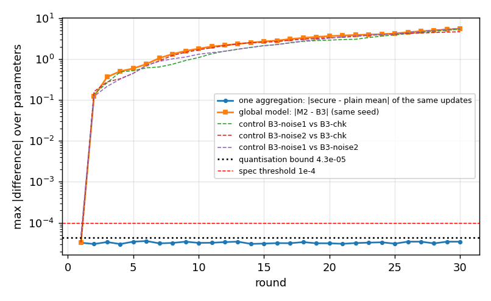

# Phase 10 - M2 (FedAvg + SecAgg+) and M3 (FedAvg + DP + SecAgg+) (6class)

Auto-generated by `ppfeddata secagg-report`. Flower 1.39.0 `SecAggPlusWorkflow` (server) and `secaggplus_mod` (client), simulation on one machine (Ray backend), 5 non-IID clients, same partitions, seeds and training as B3 / M1. SecAgg+ parameters: num_shares 5, reconstruction threshold 3, clipping range 16, quantisation range 2^22, modulus 2^32 (Flower defaults), `max_weight` 100000 (Flower default 1000 is below the client sizes 500 to about 70,000 rows; with it the FedAvg weights would be clipped, SPEC_DEVIATIONS 10.2). M3 uses the DP-specific hyper-parameters of `configs/best_cvae_dp.yaml` (M3d-t21) at target epsilon 5, and is compared with M1d-t21-eps5.

## What SecAgg does and does not give

- The server sees only the **sum** of the clients' (quantised, weighted) updates, never one client's update; with threshold t = 3 of 5 it tolerates the loss of up to 2 clients in a round (honest-but-curious server, Flower's SecAgg+ protocol).
- It does **not** protect against what the aggregate (the global model) reveals about the training data: that is the job of DP (M3). M2 has no formal privacy guarantee; M3's epsilon is the one of M1 (record level, worst client), SecAgg adds no accounting and **no amplification is claimed**.
- Flower forwards `num_examples` and the metrics dict **in the clear**: the server learns each client's row count (public in this study) and the clients here send only step counts and timings; the local training loss is not sent. The clipping check and the debug channel below write to disk beside the protocol and exist only in the simulation.
- A single-machine simulation measures the cryptographic computation, not network latency. All clients are honest (no malicious-client or malicious-server model is tested).

## T-SA1 correctness: secure aggregation vs plain FedAvg

**One aggregation, identical inputs** (seed 0, 30 rounds x 5 clients; the clients' real updates were written beside the protocol and compared with their ordinary weighted mean in float64): largest difference over all parameters and rounds **3.58e-05**; hard bound from the stochastic quantiser 4.31e-05 (5 clients x quantisation step 2*clip/2^22 divided by the total weight sum n_i / max_weight); spec gate 1e-4: OK.

**Global model, same seed, M2 vs plain B3** (`M2-chk` vs `B3-chk`, both with the global model saved every round): after round 1, where both start from the same model, the models differ by 3.3e-05 (the quantisation effect only). The distance then grows (table below). The plain pipeline is unchanged by the Phase 10 code: `B3-chk` reproduces the earlier `B3` run with max |difference| 0.0e+00. 

**Control: is this drift specific to secure aggregation?** `B3-noise1` and `B3-noise2` are plain FedAvg runs of the same seed to which Gaussian noise of std 7.6e-06 (the size of SecAgg's quantisation error: same mean absolute value) is added to the aggregate every round, with two different noise draws. Max / mean absolute difference of the global weights between pairs of runs, by round:

| pair | r1 max / mean | r2 max / mean | r3 max / mean | r5 max / mean | r10 max / mean | r20 max / mean | r30 max / mean |
|---|---|---|---|---|---|---|---|
| M2-chk vs B3-chk | 3.3e-05 / 6.3e-06 | 1.2e-01 / 9.1e-04 | 3.6e-01 / 2.4e-03 | 5.9e-01 / 5.9e-03 | 1.8e+00 / 1.7e-02 | 3.6e+00 / 4.1e-02 | 5.5e+00 / 6.7e-02 |
| B3-noise1 vs B3-chk | 3.4e-05 / 6.1e-06 | 1.4e-01 / 9.1e-04 | 2.6e-01 / 2.4e-03 | 5.2e-01 / 6.3e-03 | 1.1e+00 / 1.7e-02 | 2.9e+00 / 4.3e-02 | 5.3e+00 / 7.1e-02 |
| B3-noise2 vs B3-chk | 3.3e-05 / 6.1e-06 | 1.6e-01 / 9.0e-04 | 2.8e-01 / 2.3e-03 | 4.5e-01 / 6.1e-03 | 1.7e+00 / 1.7e-02 | 3.3e+00 / 4.2e-02 | 4.6e+00 / 6.9e-02 |
| B3-noise1 vs B3-noise2 | 5.0e-05 / 8.6e-06 | 1.2e-01 / 7.7e-04 | 2.1e-01 / 2.4e-03 | 4.5e-01 / 6.0e-03 | 1.3e+00 / 1.6e-02 | 3.2e+00 / 4.2e-02 | 5.7e+00 / 7.0e-02 |

Final validation ELBO: B3-chk 1.7638, M2-chk 1.7772, B3-noise1 1.7736, B3-noise2 1.7922. If the M2-vs-B3 distance is of the same order as the distance between plain runs that differ only by noise of that size, the drift is the sensitivity of this training process (Adam restarted every round, minibatch order fixed, no weight decay) to tiny perturbations, not a property of the secure sum.

**Test macro-F1 of the same four runs** (seed 0, full Phase 6 evaluation): 

| run (seed 0) | TSTR-rf | TSTR-mlp | TAug-rf | TAug-mlp |
|---|---|---|---|---|
| B3-chk | 0.3818 | 0.4404 | 0.4472 | 0.3534 |
| M2-chk | 0.4094 | 0.4101 | 0.4468 | 0.3523 |
| B3-noise1 | 0.4187 | 0.4379 | 0.4461 | 0.3584 |
| B3-noise2 | 0.4096 | 0.4150 | 0.4470 | 0.3374 |

| protocol | abs(M2 - B3) | abs(noise1 - B3), abs(noise2 - B3), abs(noise1 - noise2) |
|---|---|---|
| TSTR-rf | 0.0277 | 0.0369, 0.0279, 0.0091 |
| TSTR-mlp | 0.0303 | 0.0024, 0.0253, 0.0229 |
| TAug-rf | 0.0004 | 0.0011, 0.0002, 0.0009 |
| TAug-mlp | 0.0011 | 0.0050, 0.0159, 0.0209 |

This is the yardstick for the per-seed paired-bootstrap differences below: runs that differ only by noise of the size of SecAgg's quantisation error already differ in macro-F1 by 0.037 at most (TSTR), and the M2-B3 difference of this seed is larger than the largest noise-only difference for at least one protocol (only three noise-only pairs are available).

### Utility of M2 vs B3 (test macro-F1, mean ± std over seeds)

| protocol | M2 macro-F1 | B3 macro-F1 | M2 - B3 | max seed std | within seed std |
|---|---|---|---|---|---|
| TSTR-rf | 0.3979 ± 0.0083 | 0.3961 ± 0.0146 | +0.0018 | 0.0146 | True |
| TSTR-mlp | 0.4166 ± 0.0060 | 0.4199 ± 0.0145 | -0.0033 | 0.0145 | True |
| TAug-rf | 0.4478 ± 0.0007 | 0.4478 ± 0.0008 | -0.0000 | 0.0008 | True |
| TAug-mlp | 0.3582 ± 0.0042 | 0.3536 ± 0.0057 | +0.0046 | 0.0057 | True |

Paired bootstrap on the test predictions (same seed, same test set). Two runs that differ only by the quantisation noise are two draws of a chaotic training process, so single-seed differences are expected to be of the size of the seed-to-seed spread; the criterion is the one of the spec (difference inside the seed std).

| comparison | seed | diff | 95% CI | excludes 0 |
|---|---|---|---|---|
| M2-TSTR-rf - B3-TSTR-rf | 0 | +0.0277 | [+0.0233, +0.0326] | True |
| M2-TSTR-rf - B3-TSTR-rf | 1 | +0.0001 | [-0.0036, +0.0038] | False |
| M2-TSTR-rf - B3-TSTR-rf | 2 | -0.0225 | [-0.0273, -0.0175] | True |
| M2-TSTR-mlp - B3-TSTR-mlp | 0 | -0.0303 | [-0.0350, -0.0258] | True |
| M2-TSTR-mlp - B3-TSTR-mlp | 1 | +0.0058 | [+0.0035, +0.0084] | True |
| M2-TSTR-mlp - B3-TSTR-mlp | 2 | +0.0146 | [+0.0109, +0.0184] | True |
| M2-TAug-rf - B3-TAug-rf | 0 | -0.0004 | [-0.0020, +0.0011] | False |
| M2-TAug-rf - B3-TAug-rf | 1 | +0.0008 | [-0.0008, +0.0025] | False |
| M2-TAug-rf - B3-TAug-rf | 2 | -0.0004 | [-0.0022, +0.0012] | False |
| M2-TAug-mlp - B3-TAug-mlp | 0 | -0.0011 | [-0.0050, +0.0027] | False |
| M2-TAug-mlp - B3-TAug-mlp | 1 | +0.0002 | [-0.0023, +0.0029] | False |
| M2-TAug-mlp - B3-TAug-mlp | 2 | +0.0147 | [+0.0120, +0.0173] | True |

### Final models M2 vs B3 (30 rounds)

The weights of two runs are far apart (max over about 105k parameters) although the validation losses agree; this is the drift analysed above, the same size as between plain runs perturbed by noise (control: 4.6 to 5.7 for seed 0).

| seed | max abs(M2 - B3) of final weights | val loss M2 | val loss B3 |
|---|---|---|---|
| 0 | 5.506 | 1.7772 | 1.7638 |
| 1 | 8.695 | 3.2631 | 3.2970 |
| 2 | 5.115 | 1.8421 | 1.8835 |

## T-SA2 hiding: what the server receives

The masked vector each client uploaded in stage 2 (the only per-client information the server gets) was captured for rounds 1 to 3 and compared with that client's real update (15 vectors of 105,564 parameters): Pearson correlation of the masked integers with the real update, and a Kolmogorov-Smirnov test of masked / 2^32 against U[0, 1). **Largest |rho| 0.0070** (gate < 0.05: OK); **largest KS statistic 0.0039** (a uniform sample of this size gives about 0.0027; gate < 0.01: OK). Positive control: the same statistics on the UNMASKED quantised update give rho >= 1.0000 and KS >= 1.00, so the test can tell a masked from an unmasked vector (OK).

| round | client | rho (masked) | KS stat | KS p | rho (unmasked control) | KS (unmasked control) |
|---|---|---|---|---|---|---|
| 1 | 0 | -0.0057 | 0.0023 | 0.63 | 1.0000 | 1.00 |
| 1 | 1 | +0.0030 | 0.0023 | 0.63 | 1.0000 | 1.00 |
| 1 | 2 | -0.0070 | 0.0021 | 0.75 | 1.0000 | 1.00 |
| 1 | 3 | +0.0054 | 0.0025 | 0.54 | 1.0000 | 1.00 |
| 1 | 4 | -0.0047 | 0.0021 | 0.74 | 1.0000 | 1.00 |
| 2 | 0 | +0.0006 | 0.0024 | 0.56 | 1.0000 | 1.00 |
| 2 | 1 | +0.0044 | 0.0016 | 0.95 | 1.0000 | 1.00 |
| 2 | 2 | +0.0045 | 0.0023 | 0.62 | 1.0000 | 1.00 |
| 2 | 3 | +0.0021 | 0.0039 | 0.09 | 1.0000 | 1.00 |
| 2 | 4 | -0.0025 | 0.0039 | 0.09 | 1.0000 | 1.00 |
| 3 | 0 | +0.0021 | 0.0039 | 0.08 | 1.0000 | 1.00 |
| 3 | 1 | +0.0039 | 0.0027 | 0.44 | 1.0000 | 1.00 |
| 3 | 2 | -0.0021 | 0.0017 | 0.92 | 1.0000 | 1.00 |
| 3 | 3 | -0.0022 | 0.0035 | 0.15 | 1.0000 | 1.00 |
| 3 | 4 | -0.0031 | 0.0029 | 0.34 | 1.0000 | 1.00 |

## T-SA3 dropout (optional gate)

A 3-round run in which client 3 raises an exception in round 2 (Flower reports it as a failed reply). With 5 shares and threshold 3 the protocol finished the round with the remaining clients: clients aggregated per round [5, 4, 5]; error against the plain weighted mean of the clients that did deliver 3.3e-05, 4.3e-05, 3.4e-05 (bound for 4 clients 5.1e-05). OK. The unit tests (`tests/test_secagg.py`) additionally show that 2 of 5 clients may drop and that 3 dropouts (2 left < threshold) halt the protocol. In the experiments below a missing client aborts the run instead (and the run resumes from its checkpoint) so that the plan and the DP accounting stay as designed.

## Clipping range check

Every client's update (every round) is checked against the quantiser's clipping range (16); a value beyond it would be cut silently. The spec's criterion is on the raw weight |w|; what the quantiser actually clips is the weighted value w * n_i / max_weight (second column), which is smaller for every client but the largest. Flower's default range 8 was tried first: in M2 seed 1 the weights of `out.weight` reached 11.4 (the weighted maximum, 7.91, was 1 % below 8, so nothing had been cut, but with no margin), so by the spec's rule the range was raised to 16 and every Phase 10 run was repeated with it (SPEC_DEVIATIONS 10.3).

| run | updates checked | max abs(w) | max w * n_i / max_weight | clipping range | abs(w) beyond range |
|---|---|---|---|---|---|
| M2 seed 0 | 150 | 6.693 | 2.684 | 16 | 0 |
| M2 seed 1 | 150 | 10.221 | 7.112 | 16 | 0 |
| M2 seed 2 | 150 | 7.445 | 3.760 | 16 | 0 |
| M3d-t21-eps5 seed 0 | 150 | 1.576 | 0.632 | 16 | 0 |
| M3d-t21-eps5 seed 1 | 150 | 1.640 | 1.133 | 16 | 0 |
| M3d-t21-eps5 seed 2 | 150 | 1.348 | 0.657 | 16 | 0 |

## M3: DP + SecAgg

Target epsilon 5, delta 1e-05; epsilon achieved (max over clients, recomputed from the counted steps): seed 0: 4.996 (x0.999 of target), seed 1: 4.998 (x1.000 of target), seed 2: 4.999 (x1.000 of target). The steps counted are those of M1 (same schedule), so epsilon equals M1's; SecAgg does not enter the accounting.

### Utility of M3 vs M1d-t21-eps5 (same epsilon, same DP-trained schedule)

| variant | protocol | M3 macro-F1 | M1 macro-F1 | M3 - M1 | max seed std | within seed std |
|---|---|---|---|---|---|---|
| plain decoder (headline, covered by epsilon) | TSTR-rf | 0.2565 ± 0.0313 | 0.2451 ± 0.0039 | +0.0113 | 0.0313 | True |
| plain decoder (headline, covered by epsilon) | TSTR-mlp | 0.2556 ± 0.0297 | 0.2576 ± 0.0183 | -0.0019 | 0.0297 | True |
| plain decoder (headline, covered by epsilon) | TAug-rf | 0.4476 ± 0.0008 | 0.4467 ± 0.0013 | +0.0009 | 0.0013 | True |
| plain decoder (headline, covered by epsilon) | TAug-mlp | 0.3355 ± 0.0082 | 0.3411 ± 0.0094 | -0.0056 | 0.0094 | True |
| with residual noise (not covered) | TSTR-rf | 0.2943 ± 0.0276 | 0.2787 ± 0.0295 | +0.0156 | 0.0295 | True |
| with residual noise (not covered) | TSTR-mlp | 0.2897 ± 0.0176 | 0.2854 ± 0.0227 | +0.0043 | 0.0227 | True |
| with residual noise (not covered) | TAug-rf | 0.4473 ± 0.0003 | 0.4470 ± 0.0010 | +0.0003 | 0.0010 | True |
| with residual noise (not covered) | TAug-mlp | 0.3440 ± 0.0071 | 0.3388 ± 0.0142 | +0.0052 | 0.0142 | True |

### Validation ELBO and final weights, M3 vs M1

| seed | val ELBO M3 | val ELBO M1d-t21-eps5 | max abs(M3 - M1) of final weights |
|---|---|---|---|
| 0 | 4.874 | 4.900 | 0.105 |
| 1 | 9.239 | 7.545 | 0.436 |
| 2 | 5.363 | 5.347 | 0.151 |

Seed 1 is where M3 and M1 differ most in validation ELBO. Control: one more M1d-t21-eps5 run for that seed with plain-FedAvg noise of the size of the quantisation error added to the aggregate (std 7.6e-06), no SecAgg. Validation ELBO: M1d-t21-eps5 7.545, M1d-t21-eps5-noise 8.036, M3d-t21-eps5 9.239; max |difference| of final weights to the plain M1d-t21-eps5 run: M1d-t21-eps5-noise 0.390, M3d-t21-eps5 0.436. A perturbation of that size alone moves the final weights by 0.39 (M3: 0.44) and the validation ELBO by +0.49 (M3: +1.69). The DP noise itself is identical in all these runs (it depends only on the seeds). One control draw cannot say whether the M3 value lies inside the spread of such perturbations: it shows that the DP training of this seed (one client holds 79 % of the rows) reacts strongly to a 1e-5 perturbation, which is also the seed that is unstable in every DP configuration (M1 at epsilon 10: 10.7). The test macro-F1 of M3 and M1 stays inside the seed std (table above), and seeds 0 and 2 agree in ELBO to 0.03.

## Fidelity and empirical privacy of the synthetic sets (mean over classes)

SecAgg changes only how the update is summed, so the generators should match their non-secure counterparts; the MIA is the weak near-copy detector described in b2_cvae.md.

| config | seeds | C2ST AUC | Wasserstein | dup rate | DCR ratio | MIA AUC |
|---|---|---|---|---|---|---|
| B3 | 3 | 0.9998 ± 0.0001 | 0.1213 ± 0.0129 | 0.0001 ± 0.0000 | 0.9496 ± 0.0240 | 0.4913 ± 0.0023 |
| M2 | 3 | 0.9998 ± 0.0000 | 0.1243 ± 0.0162 | 0.0002 ± 0.0001 | 0.9479 ± 0.0133 | 0.4919 ± 0.0014 |
| M1d-t21-eps5-plain | 3 | 0.9999 ± 0.0001 | 0.2158 ± 0.0008 | 0.0000 ± 0.0001 | 0.9853 ± 0.0129 | 0.4880 ± 0.0042 |
| M3d-t21-eps5-plain | 3 | 0.9999 ± 0.0000 | 0.2151 ± 0.0021 | 0.0001 ± 0.0000 | 0.9788 ± 0.0128 | 0.4894 ± 0.0045 |

## Cost: overhead of secure aggregation

| config | median s/round (rounds 2+) | ratio to B3 | bytes/round |
|---|---|---|---|
| B3 (FedAvg) | 1.82 | 1.00 | 4,222,560 |
| M2 (FedAvg + SecAgg+) | 2.07 | 1.14 | 6,399,836 |
| M1d-t21-eps5 (DP) | 8.07 | 4.44 | 1,457,760 |
| M3d-t21-eps5 (DP + SecAgg+) | 8.29 | 4.56 | 2,252,614 |

Threshold `overhead_ratio_max` = 3.0 (a heuristic of the spec; applies to M2 / B3): M2 / B3 = 1.14, within the threshold. On top of DP the secure sum costs 1.03x (M3d-t21-eps5 / M1d-t21-eps5). Plain bytes/round are the float32 payload (model x clients x 2); SecAgg bytes are counted on the grid (protobuf size of every message of the four stages). The DP-tuned model is smaller than the B3 model (hidden 128-64 against 256-128), so compare M2 with B3 and M3 with M1d, not across the two families.

### Where the time and the bytes go (M2, per round, median over rounds 2+ and seeds)

| stage | median seconds | median bytes (down + up, all clients) |
|---|---|---|
| setup | 0.101 | 3,390 |
| share_keys | 0.101 | 24,703 |
| collect_masked_vectors | 1.608 | 6,369,192 |
| unmask | 0.101 | 2,535 |

The stage that carries the training request also contains the clients' local training, so its time is training + masking. The three protocol-only stages cost a fixed amount per round (about 0.1 s each in this simulation, which is the polling granularity of Flower's in-memory grid, not cryptography). Flower transmits the masked vector as int64 (8 bytes per parameter) although the modulus 2^32 would fit in 4 bytes, so the upload is twice the float32 update; the information content is 32 bits per parameter.

## Limitations

- Flower's SecAgg+ protects the individual updates from an honest-but-curious server; malicious clients/servers, collusion beyond the threshold and network effects are not tested.
- `num_examples` and the metrics dict travel in the clear in Flower's implementation; the row counts are public in this study.
- The quantiser clips at +/- 16; the check above shows the largest weight seen, but a different model or a longer training could exceed it, and the quantiser would then cut the value silently.
- The aggregate (the global model) is exactly what plain FedAvg would reveal: SecAgg does not reduce leakage from the model; only DP does (M3), at record level (see m1_dp.md for the unit of protection and the label caveat).
- Overhead is measured with 5 simulated clients on one machine (10 CPU threads shared by the server and 5 client workers); absolute times are specific to this machine.

## Gate Phase 10 checks

- tsa1_aggregation_error_within_1e-4: OK
- m2_f1_within_seed_std_of_b3: OK
- tsa2_masked_uncorrelated: OK
- tsa2_masked_uniform: OK
- tsa2_positive_control: OK
- tsa3_dropout_completes_and_is_correct: OK
- clip_range_not_exceeded: OK
- clip_range_not_exceeded_weighted: OK
- m3_epsilon_within_2pct: OK
- m3_f1_within_seed_std_of_m1: OK
- m2_overhead_below_threshold: OK
